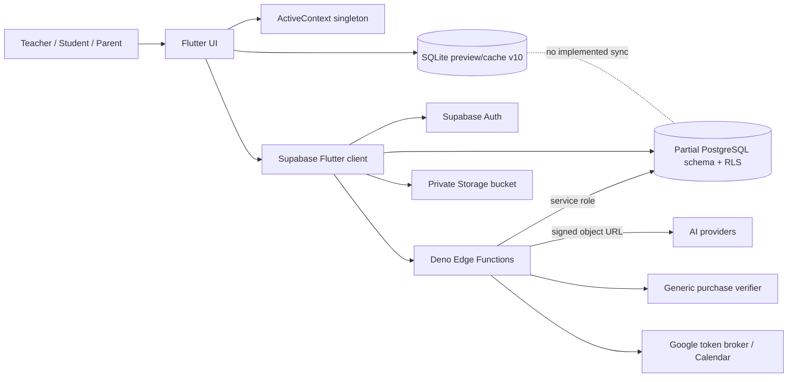
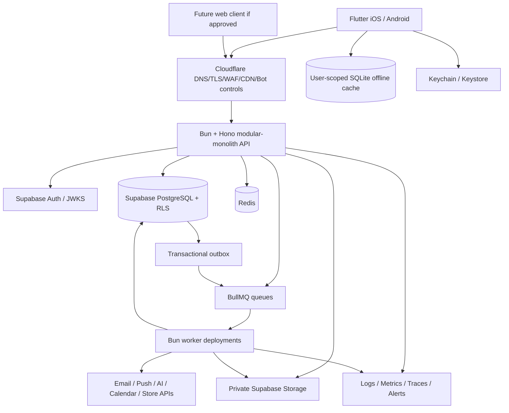
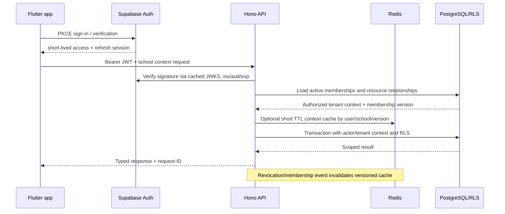
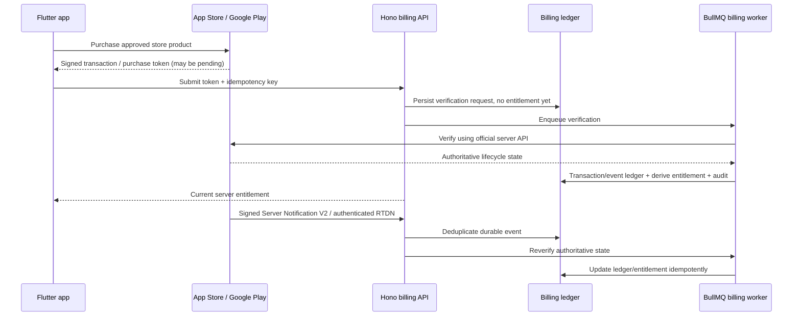
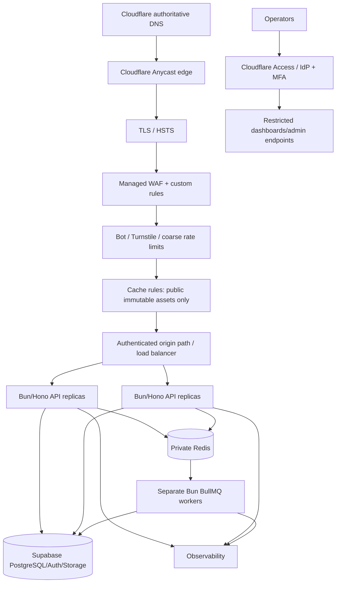

# Studafy production-readiness audit and transformation instructions

> **Document purpose:** This is the execution plan for transforming the inspected Studafy prototype into a secure, scalable production service. It is not an implementation. No phase may begin until its entry conditions are satisfied and the responsible product, security, data, and operations owners approve the phase.
>
> **Evidence boundary:** Findings labelled **Observed** come from the repository snapshot inspected on 2026-09-09. Items labelled **Proposed** are future requirements. The workspace contains no `.git` directory, so commit history, prior deletions, authorship, and historical secret exposure could not be inspected. No literal credential or private-key artifact was found by filename and source-pattern inspection; this is not proof that no secret has ever existed.

## 1. Executive summary

### What the application is

Studafy is a Flutter school platform for teachers, students, and parents. The prototype includes school/class membership, attendance, lesson notebooks, assignments and submissions, assessments and grades, wellbeing/behaviour records, guardian-to-student linking, announcements, messaging, Google Meet creation, AI-assisted paper grading, a grounded student study coach, notifications, account deletion, and a paid Parent Insights feature.

The current implementation is a functional UI prototype with a partial Supabase production foundation. Flutter static analysis passes and six existing tests pass, but most product flows remain backed by a synthetic, device-local SQLite database rather than the Supabase schema. Authentication and a small number of sensitive workflows use Supabase; core teacher, parent, and student pages still query and mutate `StudafyDatabase` directly.

### Maturity assessment

**Observed maturity: pre-alpha/prototype.** The repository demonstrates product intent and several good security instincts—PKCE authentication, a private storage bucket, RLS, service-role isolation from the client, reviewed-before-published grades, and server-side purchase verification—but does not yet form a complete, observable, deployable system.

The most important mismatch is the claim in `README.md` that Supabase is authoritative while the running feature screens primarily use SQLite. A remotely configured build creates an unseeded `studafy_cache.db`; there is no download, mutation outbox, conflict-resolution, or synchronization implementation. Therefore most authenticated screens would be empty or would write only local data that never reaches the school system of record.

### Major risks

1. **Critical private-file authorization gap:** `supabase/functions/propose-paper-grade/index.ts` signs a caller-provided storage path with a service-role client without proving that the object belongs to the selected grade result, teacher, or school. A guessed object path could be disclosed to the configured grading provider.
2. **Critical production-data incompleteness:** core screens and mutations remain local-only. Shipping this state could create data loss, inconsistent school records, misleading confirmation messages, and authorization based on hard-coded local identities.
3. **High tenant-integrity gaps:** database relationships do not consistently enforce that related school-owned rows share the same `school_id`; the submission update RLS policy does not re-check assignment enrollment/publication when assignment or student identifiers change.
4. **High privileged-workflow weaknesses:** service-role Edge Functions lack strict runtime schemas, idempotency, transactions, timeouts, rate limits, structured audit/error handling, and safe retry design.
5. **High upload risk:** there is no object metadata ownership model, quarantine, file-signature verification, malware scan, archive protection, sanitisation, quota, or publication gate.
6. **High release blockers:** Android and iOS use example identifiers; Android release is debug-signed and its main manifest lacks the internet permission; iOS has no privacy manifest.
7. **High operational risk:** no CI/CD, deployment definition, Redis, BullMQ, Cloudflare configuration, central logging, metrics, tracing, alerting, runbooks, or backup-restore evidence exists.
8. **High assurance gap:** the six passing Flutter tests do not exercise repositories, authentication, RLS, tenant isolation, uploads, payments, queues, or failure handling. The SQL authorization test contains unresolved fixture placeholders.

### Recommended target architecture

Use one monorepo and a **modular monolith**, not microservices:

- Keep Flutter for iOS and Android; migrate the existing root app gradually into `apps/mobile` only after build tooling supports the move.
- Add a containerised Bun/Hono API in `apps/api` and long-running Bun/BullMQ workers in `apps/worker`.
- Keep Supabase PostgreSQL, Supabase Auth, and private Supabase Storage as authoritative systems.
- Use Redis for rate limiting, carefully selected caches, idempotency coordination, and BullMQ.
- Put Cloudflare DNS, TLS, CDN, WAF, DDoS/bot controls, and origin protection in front of the API. Do not run BullMQ workers in Cloudflare Workers.
- Retain SQLite only through typed repositories as an encrypted-at-rest-by-platform, user-scoped offline cache. Server state wins for authorization, grades, entitlements, memberships, and audit history.
- Migrate each Deno Edge Function to an equivalent versioned Hono route after contract, authorization, idempotency, and rollback tests pass; keep only explicitly justified Supabase hooks/functions.

Hono documents Bun as a supported runtime, and current BullMQ documentation provides `createBunRedisClient`. Phase 0 must pin exact versions and prove queue semantics, reconnect behaviour, duplicated blocking connections, graceful shutdown, and the selected Redis provider under load before this becomes a production commitment.

### Refactor versus rewrite

Use a strangler-style refactor. Preserve the Flutter interaction design and tested insight calculations. Introduce typed domain/repository boundaries around vertical slices, move authoritative logic to Hono/PostgreSQL, then replace direct SQLite calls screen by screen. Do not rewrite the whole client or edit already-applied migrations in place. Replace unsafe remote functions incrementally behind feature flags and compatible API contracts.

### Recommended order

1. Contain the private-file and release risks; establish repository history, owners, environments, and reproducible checks.
2. Create monorepo boundaries, typed contracts, and a Hono API skeleton without moving all screens at once.
3. repair tenant constraints, RLS, indexes, migrations, and test fixtures.
4. Implement authentication/authorization and the first complete server-backed vertical slice.
5. Move uploads and file processing behind quarantine and metadata records.
6. Add Redis, rate limits, BullMQ, payment lifecycle processing, Cloudflare, and observability.
7. Migrate mobile features in controlled slices, rehearse existing-data migration, pilot with synthetic and then approved school data, and scale only from measured thresholds.

### Assumptions and unresolved matters

- **Default:** a school is the tenant boundary; a user may hold multiple roles in multiple schools.
- **Default:** Flutter remains the mobile client. The generated Flutter web/desktop targets are not production commitments.
- **Default:** deploy API and worker containers in the same approved region as the primary Supabase project and Redis; exact providers are Phase 0 decisions.
- **Default:** Supabase Storage remains primary. Consider Cloudflare R2 only after a documented cost, residency, access-control, and operational comparison.
- **Default:** store timestamps in UTC (`timestamptz`) and render using each school's IANA time zone, initially `Asia/Riyadh` where configured.
- **Requires decision:** Saudi hosting/data-transfer constraints, student age ranges, guardian verification authority, school provisioning, paid-product purchaser/beneficiary rules, record retention, legal bases, notification vendors, and RTO/RPO.
- Legal and policy statements in this plan are engineering prompts, not legal conclusions. Saudi PDPL, children's data, education-record obligations, GDPR applicability, store rules, and cross-border transfers require qualified review.

## 2. Current codebase audit

### Repository and application structure

| Area | Observed responsibility | Problem or limitation | Security/scaling impact | Recommended action | Priority |
|---|---|---|---|---|---|
| Repository root | Flutter app plus Android, iOS, web, Linux, macOS, Windows scaffolds | No workspace/monorepo manifest, `.git`, CI, release policy, ownership, or architecture decision records | No trustworthy change history or automated gate; unclear supported platforms | Establish Git history and ownership first; introduce monorepo layout incrementally | Critical |
| `lib/main.dart` | Bootstrap, theme, auth/role selection, navigation, teacher home and dialogs | 1,599 lines; UI, navigation, auth state, consent, and local data writes mixed | Hard to test; navigation can diverge from authenticated context | Split bootstrap, routing, auth presentation, shells, and feature modules | High |
| `lib/*_features.dart` | Almost all teacher/student/parent screens and workflows | Three files total 14,937 lines; direct data access, state, validation, files, business calculations, and UI mixed | High regression risk; authorization assumptions live in UI | Migrate by vertical slice into presentation/application/domain/data folders | High |
| `lib/studafy_database.dart` | SQLite schema v10, migrations, seed data, file copying, queries, commands, audit simulations | 1,333-line god object; preview database and alleged production cache share one API; many untyped maps; no sync engine | Local confirmation may not represent server state; user/tenant isolation is not modelled | Separate preview fixture, offline cache, DAOs, sync metadata, and repositories; ban direct widget access | Critical |
| `lib/core/studafy_domain.dart` | Role/profile/context and insight/AI models | Singleton mutable context; role switching has demo fallback; model coverage is partial | Stale or incorrect tenant context can reach multiple screens | Introduce immutable authenticated context, explicit lifecycle, and typed IDs | High |
| `lib/data/*` | Supabase bootstrap, repository interfaces, remote functions, IAP and study coach | Partial interfaces; dynamic JSON casts; errors mapped to `StateError`; most feature domains absent | Contract drift and runtime crashes; inconsistent offline/remote semantics | Generate typed DTOs from OpenAPI and define domain-specific repositories/results | High |
| `supabase/migrations` | 29 public tables/types/functions/policies and private bucket | Sparse indexes; incomplete tenant invariants; missing admin role; inconsistent timestamps; potentially applied files cannot safely be rewritten | RLS and joins will degrade; cross-tenant relationships depend on trusted writers | Add forward-only corrective migrations with pgTAP tests and query-plan evidence | Critical |
| `supabase/functions` | Eight Deno service-role workflows | Different runtime from target; repeated auth/bootstrap; wildcard CORS; weak validation/idempotency/transactions | Privileged defects have broad blast radius | Contain critical flaws, then migrate route-by-route to shared Hono middleware/services | Critical |
| `supabase/tests/rls_access.sql` | Eight intended RLS assertions | Placeholder variables and no fixture/runner; first assertions occur before role/JWT setup shown in the file | Security suite is not reproducibly runnable | Build disposable synthetic multi-school fixture and automated pgTAP runner | Critical |
| `test` | Five insight-engine unit tests and one widget test | No repository, auth, storage, payment, synchronization, or integration tests | Passing status gives little production assurance | Add layered tests and minimum coverage/change-risk gates | High |
| `android`, `ios` | Native Flutter runners and OAuth callback | Example IDs, debug Android release signing, missing main internet permission, missing iOS privacy manifest | Store rejection, insecure signing, non-functional release networking | Create environment-specific identifiers/signing/privacy configuration | Critical |
| `README.md` | Local/Supabase deployment notes and safety claims | Describes Supabase as authoritative before core flows use it; manual deployment steps only | Operators may overestimate readiness | Rewrite only after implemented behaviour matches operational documentation | High |
| Generated directories | `build/` about 879 MB; `.dart_tool/` about 159 MB | Repository snapshot is about 1 GB; without Git metadata tracked status cannot be proven | Slower transfer/scanning; possible artifact leakage | Restore Git, verify ignore rules, remove generated artifacts only with approval | Low |

### Critical/high finding traceability register

Every item below must stay linked to its roadmap/backlog task. “Negative test” is the minimum adversarial assertion; the referenced phase part contains the complete acceptance criteria.

| Finding and evidence | Current responsibility | Problem and impact | Required action / priority | Task / minimum negative test |
|---|---|---|---|---|
| `supabase/functions/propose-paper-grade/index.ts:13-33` | Authorizes grading and signs a scan for the AI provider | Service role signs caller-selected `private_scan_path` without a submission/file binding; potential cross-tenant private-file disclosure | Disable, then require clean server-owned `file_object_id` bound to grade/school/teacher / **Critical** | `SEC-001`, `FILE-050/051`; another teacher's guessed path never yields a signed URL or provider call |
| `lib/studafy_database.dart`, all feature files | Provides almost every product read/write | Remote cache is unseeded and unsynchronized; confirmed UI actions remain local and can be lost/inconsistent / **Critical** | Gate production, add repositories and migrate complete authoritative slices / **Critical** | `ARC-011`, `API-041`, `MOB-070`; change device/account and prove committed state remains correct |
| `supabase/migrations/202609080002_access_policies.sql:97-99` | Lets students update their submission | Resulting assignment/enrollment/publication and immutable relationship fields are not checked / **Critical** | Replace policy/column grants with command path and tenant constraints | `DB-021`; substitute another class/school assignment ID and require denial/no row change |
| Existing schema FKs in `202609080001_production_foundation.sql` | Relates terms, students, classrooms, enrollments, results and content | Same-school consistency is not structurally enforced; a privileged bug can construct cross-tenant graphs / **Critical** | Add non-null ownership and composite tenant FKs through forward migration | `DB-020`; every cross-school relationship insert/update fails at DB boundary |
| `supabase/functions/*` | Privileged mutations using service role | No common strict schemas, request/body limits, idempotency, transactions, timeouts or redacted error contract / **High** | Shared Hono middleware/use cases and transactional commands; restrict service role | `API-040/041`; malformed, oversized, replayed and partially failing commands produce no duplicate/partial state |
| `create-google-meet/index.ts:31-80` | Expands recipients and creates Calendar event | N+1 DB/Auth calls and external side effect before durable idempotency; retries can duplicate/orphan events / **High** | Desired-state command plus outbox worker, set-based recipients and reconciliation | `OPS-061`; crash at every side-effect boundary still produces one logical meeting |
| `approve-paper-grade` and `publish-grade-result` | Review/publish state transitions | Sequential updates, duplicate-question weakness, ignored write errors and duplicate publish notification risk / **High** | Transactional, versioned state machine with unique question set and idempotency | `API-041`; duplicate/omitted question and concurrent/replayed publish are rejected/idempotent |
| `request-account-deletion/index.ts:12-15` | Enforces recent authentication | JWT issuance/refresh time is not interactive reauthentication; destructive action may bypass intended assurance / **High** | Supabase-supported recent-auth challenge/MFA evidence and deletion workflow | `AUTH-030`; refreshed but non-reauthenticated session cannot request deletion |
| `202609090001_tighten_student_access.sql:140-146` and Flutter uploads | Allows namespaced direct storage insertion | No metadata ownership, type/signature validation, quarantine, malware/CDR, quota or clean-publication state / **High** | Upload-intent and isolated scan pipeline; deny legacy direct publication | `FILE-050/051`; malicious/mismatched/oversized/cross-binding object is never downloadable |
| Migration index inventory | Supports RLS and list queries | Only two explicit non-unique indexes; nested policy/query paths can scan at school scale / **High** | Query-linked composite/partial indexes with plan tests and monitoring | `DB-020/021`; production-like RLS/list plans remain within approved scan/latency budget |
| `lib/data/subscription_service.dart` and `verify-store-purchase` | Starts purchases and writes one user entitlement | No store event/transaction ledger, lifecycle webhooks, multiple products, replay ownership or reconciliation / **High** | Official Apple/Google verification, immutable ledger/events and derived entitlement | `PAY-071`; duplicate/out-of-order refund/revoke removes/grants access exactly once correctly |
| `android/app/build.gradle.kts`, Android manifest, iOS project/Info.plist | Defines store artifacts/network/signing/privacy | Example IDs, Android debug release signing, no main internet permission, missing iOS privacy manifest / **Critical** | Final organization IDs, protected signing, permissions/declarations and CI release assertions | `REL-002`, `INFRA-081`; intentionally unsafe release configuration must fail CI/store smoke |
| `lib/main.dart:358-463`, `studafy_domain.dart:104-116` | Selects role and maintains session context | Production navigation shares demo fallback and incomplete restore/revocation lifecycle / **High** | Production flavour exclusion, immutable server context and full session state machine | `ARC-011`, `AUTH-030/031`; user without active membership cannot enter any role, including after restart/offline |
| `_shared/http.ts` | Supplies CORS/JSON response | Wildcard CORS and no shared security/error/request-ID policy / **High** | Exact origins and Hono middleware stack behind protected origin | `API-040`, `INFRA-080`; unapproved origin/host and spoofed proxy headers are rejected |
| Repository-wide logging/error patterns | Handles operational failure | Raw server causes may be returned while many client errors are swallowed; no metrics/traces/alerts / **High** | Stable safe errors, structured redacted telemetry, SLOs and runbooks | `API-040`, `OPS-090`; seeded secrets/PII never appear and injected outage raises actionable alert |
| `supabase/tests/rls_access.sql` and `test/` | Current verification | Placeholder RLS fixture; only six Flutter tests; no security/integration/payment/file/queue tests / **Critical** | Disposable fixtures and layered mandatory test gates | `TEST-006`, then every phase; cross-tenant substitution suite must run from clean environment |
| Missing `.git`, CI/IaC/deployment files | Change and deployment governance | Cannot inspect history or reproduce/approve production changes / **Critical** | Restore history/owners and signed/scanned CI/CD/IaC | `GOV-003`, `INFRA-080/081`; clean clone and rollback rehearsal produce identical verified artifacts |

### Secondary maintainability and completeness findings

- No Dart import cycle was observed from the inspected imports, but parent/student modules depend laterally on teacher UI for `DeleteAccountPage`; move account UI to an account feature shared through an inward-facing contract.
- `notebooks`/`lesson_notes`, `class_schedule`/`class_sessions`, `submissions`/`assessment_submissions`, and local/remote grade concepts overlap. Treat old local tables as migration inputs, not parallel production domain models.
- The QR painter is not an interoperable QR encoder and the scanner returns a hard-coded ID. Replace with a vetted QR library and real camera flow only after the locator/linking threat model; the code must never imply that the locator proves identity.
- Most English UI literals bypass the small English/Arabic localization dictionary; RTL, pluralization, date/number formatting and accessibility are incomplete.
- Generated desktop/web platform scaffolds may be unused, but do not delete them until supported-platform decisions and a Git baseline exist. Generated plugin registrants/build artifacts are not hand-edited.
- `pubspec.yaml` still carries template description/comments and version `1.0.0+1`; establish product metadata and version/release policy before store submission.

### Large and overly complex files

| File | Approximate size | Responsibilities mixed together | Proposed separation |
|---|---:|---|---|
| `lib/teacher_features.dart` | 5,652 lines / 209 KB | Classroom CRUD, schedules, attendance, notebooks, files, gradebook, AI grading, content, meetings, communications, profile/settings, deletion, connections, messages | `features/classes`, `attendance`, `notebooks`, `assessments`, `grading`, `content`, `meetings`, `messages`, `account`; each with presentation/application/data boundaries |
| `lib/student_features.dart` | 4,860 lines / 163 KB | Dashboard, grades, attendance, notebook, assignments/uploads, exams, notifications, AI coach/quiz/flashcards, profile/settings | Separate the same domain slices; share only design primitives and typed contracts |
| `lib/parent_features.dart` | 4,425 lines / 146 KB | Child linking/switching, academics, insights/paywall, behaviour, notifications/messages, account | `family`, `academics`, `insights`, `wellbeing`, `messages`, `account` modules |
| `lib/main.dart` | 1,599 lines / 49 KB | App bootstrap, theme, splash, role selection, OAuth/consent, shells, teacher dashboard, class/attendance/notebook dialogs | `app/bootstrap`, `app/router`, `auth`, `design_system`, and domain features |
| `lib/studafy_database.dart` | 1,333 lines / 52 KB | Schema lifecycle, seeds, queries, commands, local files, fake audit/deletion/entitlement behaviour | versioned cache schema, typed DAOs, mutation outbox, sync coordinator, preview fixture, file cache adapter |

**File rule proposed for new code:** one primary responsibility per file; normally keep production source below 300 lines and functions below 50 lines. Exceeding either is not an automatic failure, but requires a review note explaining cohesion and testability. Route registration, generated contracts, migrations, and declarative mappings are exceptions.

### Coupling, duplication, types, and validation

- **Observed:** presentation widgets import `StudafyDatabase` and call SQL-facing methods directly. Teacher, parent, and student files also import shared deletion UI from the teacher feature file, creating inappropriate feature-to-feature coupling.
- **Observed:** colours, headers, cards, role/profile assumptions, messages, and query-to-map conversion are duplicated across files.
- **Observed:** application records use `Map<String, Object?>` and remote payloads use `Map<String, dynamic>` with unchecked casts. SQLite integer IDs and Supabase UUID string IDs coexist, connected by nullable `remote_id` values.
- **Observed:** client forms perform uneven validation. Edge Functions parse `request.json()` directly and trust field shapes, lengths, numeric finiteness, URL/path formats, and enums inconsistently.
- **Observed:** many asynchronous errors are swallowed (`catch (_)`) or displayed using raw exception strings. Server functions sometimes return database/provider exception messages as HTTP 400 responses.
- **Action:** introduce branded/typed identifiers, immutable entities, command/query DTOs, schema-derived validation, `Result`/typed failure classes, a repository boundary, and a centralized error catalogue. UI code may format failures but may not decide authorization.

### Authentication and authorization audit

- **Positive:** Supabase Auth uses PKCE and the client contains only URL/publishable-key configuration. No service-role key is embedded in Flutter.
- **Observed:** role choice precedes authentication; after login the client requires a matching active membership. This is a UI routing convenience, not authorization; every API/RLS path must independently verify membership and relationship.
- **Observed:** the app always opens splash/role selection and does not have a tested session restoration, revocation, multi-device, or expired-session state machine.
- **Observed:** consent is recorded with a hard-coded policy version after OAuth callback. The displayed policy text is embedded placeholder copy rather than versioned legal content.
- **Observed:** `ActiveContextController.switchRole` falls back to starting a demo role if no membership is found. Demo mode must be impossible in production flavours.
- **Observed:** there is no administrator role even though the target requires administrators and trusted provisioning.
- **Observed:** `request-account-deletion` checks JWT `iat`; token refresh is not proof of recent interactive authentication.
- **Action:** implement server-verified sessions, explicit tenant context, RBAC plus student/guardian/class relationships, privileged MFA, recent-auth evidence, revocation-aware caches, production flavour guards, and server-owned membership/provisioning.

### Database and RLS audit

- `students.school_id` is nullable while nearly all authorization assumes school ownership.
- `studafy_id` is globally unique and human-readable; it can become an enumeration/link-spam target. Treat it as a public locator, never proof of relationship, and add throttled server-mediated verification.
- Foreign keys such as classroom-to-term, enrollment-to-student, assessment/result, and guardian relationships do not enforce same-school ownership. A service-role bug can create cross-school graphs that RLS was not designed to contain.
- The student submission update policy checks only that the resulting `student_id` belongs to the caller; it does not re-check the assignment, active enrollment, publication state, deadline policy, or immutable fields.
- `profiles update self` and consent update policies permit direct changes to all currently exposed mutable columns. Future privileged columns must never be added to these tables without column grants or restricted RPC/API paths.
- `can_access_student` and `can_access_classroom` are `SECURITY DEFINER`; the later migration uses `search_path = public` rather than an empty search path with fully qualified objects. Function ownership, execute grants, leakproof assumptions, and RLS recursion need a dedicated audit.
- RLS policies frequently traverse unindexed foreign-key/filter columns. Only `meeting_deliveries(recipient_id,state)` and a partial deletion-due index are explicitly created.
- Most tables lack `updated_at`; soft deletion/archival rules are inconsistent; lifecycle states lack state-transition enforcement; `audit_events` is not explicitly append-only/tamper-evident.
- Multi-row grade, notification, meeting, and audit updates are not atomic.

### File, AI, payment, and third-party audit

- Storage permits authenticated inserts only under `papers/{auth.uid()}` or `coach/{auth.uid()}`, but uploaded objects are not registered in a tenant/resource metadata table.
- Flutter reads selected files entirely into memory before upload, has no size/type checks, and displays success before any security scan.
- AI paper grading signs an arbitrary caller-provided path through the service role. The path is not checked against `papers/{teacher}/{submission}` or a file record, and the signed URL is sent to a third party.
- AI responses are shape-cast and partially clamped, but completeness, duplicate question IDs, non-finite numbers, output size, model policy, prompt-injection handling, and retention are not robustly enforced.
- Grade approval loops over row updates without a database transaction; duplicate input question IDs can satisfy the length check while omitting another question. Publication retries can create duplicate notifications.
- Google Meet creation has enrollment-to-guardian and auth-admin N+1 calls, validates little input, creates the external event before durable idempotency state, and cannot compensate reliably if local persistence fails.
- `subscription_entitlements` has one row per user, insufficient for multiple products, history, purchaser/beneficiary distinctions, transaction uniqueness, grace/hold/refund/revocation, or webhook reconciliation.
- The client forwards store verification data to a generic verifier endpoint but the repository contains no Apple App Store Server Notifications V2 or Google RTDN receiver, signed-payload verification, transaction ledger, or reconciliation worker.

### Dependencies and supply chain

- The Flutter lockfile contains 130 hosted packages and five SDK packages with content hashes; there are no Git/path dependencies observed.
- No automated vulnerability, licence, provenance, SBOM, secret, or dependency-update workflow exists.
- Deno functions import the floating major URL `https://esm.sh/@supabase/supabase-js@2`, which is not an immutable dependency pin.
- Bun 1.3.14 and Docker are available in the inspected environment; Supabase CLI is not. Environment availability is not a production version policy.
- Before implementation, produce a dependency inventory, run current ecosystem-native advisory scans, pin Bun/Flutter/Dart/Java/Gradle/Xcode and package versions, verify lockfiles in CI, and require review for new runtime dependencies.

### Performance and scaling bottlenecks

- Client dashboards execute many independent local queries and pass large dynamic maps through widgets; no remote pagination/sync exists.
- Remote notification count fetches every unread notification ID and counts client-side.
- Meeting creation performs per-student guardian queries and per-recipient Auth Admin queries.
- RLS functions and policies execute nested membership/enrollment/guardian checks with missing supporting indexes.
- Study Coach sends up to 30 material bodies to another service without deterministic ordering, token budgets, chunking, retrieval indexing, or per-tenant cost controls.
- No connection-pool limits, backpressure, timeouts, load shedding, queue concurrency policy, or hot-tenant protection exists.

### Verification baseline

- `flutter analyze`: passed with no issues on 2026-09-09.
- `flutter test --concurrency=1`: six tests passed (five unit tests and one widget test).
- Supabase RLS tests: not run; fixture variables and local Supabase tooling are missing.
- Builds, native release signing, migrations, Edge Functions, IAP sandboxes, load tests, secret history, and deployment were not verified.

## 3. Proposed system architecture

### Current architecture



### Target architecture



### Monorepo layout

```text
studafy/
├── apps/
│   ├── mobile/                 # existing Flutter app, moved only after tooling is ready
│   │   └── lib/
│   │       ├── app/            # bootstrap, routing, session, feature flags
│   │       ├── core/           # design, localization, networking, offline primitives
│   │       └── features/       # vertical slices with presentation/application/domain/data
│   ├── api/
│   │   └── src/
│   │       ├── bootstrap/      # configuration, server, shutdown
│   │       ├── middleware/     # request ID, auth, tenant, limits, errors, logging
│   │       └── modules/        # domain route/application adapters
│   └── worker/
│       └── src/                # processors, schedulers, queue lifecycle
├── packages/
│   ├── contracts/              # Zod/OpenAPI request, response, event, job contracts
│   ├── domain/                 # pure policies, entities, value objects
│   ├── database/               # query modules, transactions, generated DB types
│   ├── infrastructure/         # Redis, storage, providers, crypto adapters
│   ├── observability/          # logs, traces, metrics, redaction
│   ├── config/                 # typed environment schemas
│   └── test-support/           # factories, fixtures, fake clock/IDs/providers
├── supabase/
│   ├── migrations/             # existing plus forward-only corrective migrations
│   ├── tests/                  # pgTAP RLS/constraint/query tests
│   └── seed.sql                # synthetic local-only fixtures
├── infrastructure/
│   ├── cloudflare/
│   ├── runtime/
│   ├── redis/
│   └── observability/
├── docs/                       # ADRs, runbooks, threat models, API docs
├── package.json
├── bun.lock
└── pubspec workspace/configuration as supported by chosen Flutter layout
```

Do not move the Flutter root in the same change that introduces the API. First make existing Flutter commands runnable from both old and planned locations in CI; then perform a mechanical move with no behaviour changes.

### Application and domain boundaries

| Module | Owns | Must not own |
|---|---|---|
| Identity and tenancy | profiles, sessions, memberships, role grants, active tenant resolution, MFA/recent-auth policy | classroom relationship decisions |
| Schools and terms | school configuration, terms, time zone, retention policy references | authentication credentials |
| Classes and enrollment | classrooms, schedules, teacher assignment, enrollment lifecycle | grades or payment entitlement |
| Families | student identity, guardian invitations/verification/revocation, relationship policy | direct role elevation |
| Learning content | lesson sessions, immutable resources, publications | raw storage provider calls |
| Assignments/submissions | assignment lifecycle, submission attempts, acknowledgements | grade publication |
| Assessments/grading | questions, results, review and publication state machine, AI proposals | AI provider credentials |
| Attendance/wellbeing | attendance states, reasons, wellbeing/incident access and retention | generic messaging |
| Communications/meetings | conversations, announcements, meeting commands and audiences | provider-specific token storage in domain code |
| Files | upload sessions, objects, scan state, deduplication, signed delivery, deletion | content visibility policy by itself |
| Billing/entitlements | products, transactions, store events, entitlement derivation | client-reported entitlement truth |
| Notifications | preferences, outbox, fan-out, delivery attempts | source-domain transaction ownership |
| Audit | append-only security/business events and export | mutable operational logs |

### Dependency and engineering rules

1. Routes and UI call application use cases; use cases call domain policies and repository ports; adapters depend inward. Domain packages import no Hono, Supabase, Redis, Flutter, or store SDK code.
2. Cross-module writes occur through an application use case and one explicit transaction. Cross-module asynchronous reactions use an outbox event.
3. No widget or Hono handler directly executes SQL, calls a service-role client, constructs a storage path, or grants a role/entitlement.
4. All external inputs—including provider responses—are runtime validated. TypeScript compile-time types are not validation.
5. Use lowercase `snake_case` for SQL, `kebab-case` HTTP resources, `camelCase` JSON, PascalCase types, and verb-led application commands.
6. Public contracts live in `packages/contracts`; database row types never become public response types.
7. Configuration is parsed once at startup using an allowlisted schema. Processes fail closed on missing production secrets; clients contain only public configuration.
8. Errors use stable machine codes and safe messages. Internal cause/stack is recorded with request/job ID and redaction, never returned by default.
9. Use structured JSON logs, OpenTelemetry-compatible traces/metrics, UTC timestamps, a dependency-injected clock, and correlation IDs.
10. Database access uses bounded pools, parameterised queries, explicit selected columns, transactions for state changes, cursor pagination, and query-plan tests for hot paths.
11. Unit tests accompany pure policy; integration tests accompany adapters; authorization changes require positive and negative RLS/API tests.
12. Generated code and schemas are reproducible and checked for drift. No floating runtime imports are allowed.

### Mobile and web integration

- Replace direct SQLite access with feature repositories returning typed entities and pagination/sync metadata.
- Store Supabase refresh/session material only through platform-secure storage (iOS Keychain and Android Keystore-backed storage). Never place service, Redis, database, AI, Calendar, or store API credentials in Flutter.
- Use an authenticated API client with request ID, idempotency key support, retry classification, certificate/TLS validation, and backward-compatible contract versions.
- Cache only server-authorized data scoped by `{user_id, school_id, role}`; wipe or cryptographically make inaccessible on sign-out, membership revocation, or account switch.
- Implement offline mutation outbox records with UUID operation IDs, expected resource version, retry state, and user-visible conflict handling. Never allow offline authorization, entitlement, grade publication, guardian verification, or destructive account changes.
- Keep generated Flutter web support as non-production until audience, SEO, accessibility, session-cookie/CSRF, and deployment requirements are approved. Any future web client uses the same `/v1` contracts, not database access.

## 4. PostgreSQL and Supabase database architecture

### Tenancy and identity model

Use `schools` as the tenant table unless Phase 0 confirms a separate commercial `organisations` layer is required. If school groups require consolidated billing/administration, add `organisations` and `organisation_schools`; do not overload school membership.

Every school-owned aggregate carries a non-null `school_id`, even when derivable, so policies and indexes have a stable tenant prefix. Composite foreign keys enforce same-school relations. Users are global Supabase Auth identities; authorization is always derived from active memberships plus resource relationships. A user can be an administrator in one school, teacher in another, and guardian in a third without copying their identity.

Recommended roles are `platform_support` (never an app membership; privileged just-in-time operations only), `school_admin`, `teacher`, `guardian`, and `student`. `parent` can remain an API display term while the authorization role becomes `guardian`. Permissions are server-defined; clients submit neither roles nor school IDs for authorization decisions.

### Major tables

All UUID primary keys default to `gen_random_uuid()` unless an existing compatible key is retained. All mutable tables have `created_at timestamptz not null`, `updated_at timestamptz not null`, and where applicable `deleted_at timestamptz`; update timestamps are maintained consistently. Append-only tables do not need `updated_at`.

| Table | Purpose and important columns | Keys, constraints, relationships | RLS and likely query-backed indexes | Sensitive fields and retention |
|---|---|---|---|---|
| `schools` | Tenant settings: `name`, `status`, `timezone`, `locale`, policy/retention references | PK `id`; valid IANA time-zone validation in application plus controlled DB check/reference; optional organisation FK | Active members read limited settings; admins manage. Index active/status only if operational queries use it | School configuration; retain contract/audit references after closure per policy |
| `profiles` | Global user presentation: `display_name`, `locale`, lifecycle state | PK/FK `id -> auth.users`; no role columns | Self read/update only for allowlisted fields; staff lookup through authorized API. Avoid broad searchable index until required | PII; pseudonymise/delete subject to school-record obligations |
| `memberships` | User role in school: `school_id`, `user_id`, `role`, `status`, `valid_from/to`, `version` | Unique active membership per school/user/role; role/status checks; FKs to school/profile | Self and authorized school admins. Index `(user_id,status)` for login context and `(school_id,role,status,user_id)` for rosters/RLS | Authorization-critical; retain history in membership events/audit |
| `membership_events` | Append-only grants, suspensions, revocations | Bigint PK; FK membership; actor/reason; unique idempotency key | Admin/security only. Index membership/time and school/time | Security audit; long retention defined by legal policy |
| `terms` | School terms: dates, status | Composite uniqueness `(school_id,name)`; `starts_on <= ends_on`; at most one active term enforced by partial unique index if product confirms | Members read; admins write. `(school_id,status,starts_on)` supports current term | Low sensitivity; retain with academic records |
| `students` | School-local student record: `school_id`, optional `user_id`, public locator hash/value, display/legal fields separated, `provisional` | `school_id not null`; composite unique `(school_id,id)`; user can map to multiple school student records only if approved; locator uniqueness scoped/rotatable | Student self, verified guardians, assigned teachers/admins. Index `(user_id)` where non-null and `(school_id,studafy_id)` only for exact throttled lookup | Children's PII; strict minimisation and retention; never expose roster-wide lookup |
| `guardian_links` | Relationship and verification lifecycle: guardian, student, type, status, evidence reference, expiry | Include `school_id`; composite FKs ensure student belongs to school; unique active pair; verifier must be authorized | Parties and school admins read appropriate view; only server workflow changes status. `(guardian_id,status,school_id)` and `(student_id,status)` support child/access queries | Relationship/evidence is sensitive; evidence may need shorter retention than link history |
| `classrooms` | Class identity, term, grade, section, status | Include `school_id`; composite FK term/school; replace single `teacher_id` with assignments if co-teaching is required | Authorized class relationships. `(school_id,term_id,status,id)` for list cursors | Retain/archive with academic records |
| `classroom_staff` | Teacher/admin assignments with role and dates | Composite PK/unique classroom/user/role active period; same-school membership FK/validation | Assigned staff and admins. `(user_id,status,classroom_id)` supports teacher dashboard and RLS | Authorization-critical history |
| `enrollments` | Student membership in classroom with status/dates | Include `school_id`; same-school composite FKs; prevent overlapping duplicate active enrollment | Student/guardian/class staff/admin. `(student_id,status,classroom_id)` and `(classroom_id,status,student_id)` directly serve access/rosters | Academic relationship; retain history rather than destructive delete |
| `class_schedules` | Recurring local schedule: weekday, local start/end, effective dates | Same-school classroom FK; valid weekday/time range; non-overlap rule if required | Class relationships read; staff write. `(classroom_id,effective_from)` | Low sensitivity; retain term history |
| `lesson_sessions` | Actual scheduled occurrence and filing state | Same-school classroom FK; `ends_at > starts_at`; unique classroom/start; status transition checks | Class relationships; unpublished content limited to staff. `(classroom_id,starts_at,id)` cursor | Academic record retention |
| `resources` | Logical immutable learning/file-backed content: title/body/type/current version | Include school/creator; content state; no recipient copies | Authorized creators/readers. `(school_id,state,created_at,id)` and creator index where used | May contain student/teacher content; retention by resource policy |
| `resource_versions` | Immutable content version and optional `file_object_id` | Unique resource/version; hash of canonical content; FK file object | Visibility derived through publications, not raw object | Immutable; delete physical data only after all references/holds expire |
| `resource_publications` | Publishes one resource/version to school/class/audience | Include school, target type/id, state, publish/withdraw times; constraint valid target | Audience plus active membership/enrollment. `(classroom_id,state,published_at,id)` for feeds | Publication history retained; no per-recipient physical rows |
| `assignments` | Assignment lifecycle, instructions, due/close times, resource link | Same-school classroom FK; valid state transitions/times; creator membership | Class staff see drafts; enrolled students/guardians see published. `(classroom_id,state,due_at,id)` | Academic record |
| `submissions` / `submission_attempts` | Stable assignment/student relation plus immutable attempts, selected current attempt | Same-school assignment/student/enrollment validation; unique assignment/student; idempotent attempt operation ID | Student owns writes within policy; staff read class; guardian read after policy. Index student/status/due and assignment/status | Student work; retention/export/deletion policy, plagiarism/legal holds |
| `assessments` | Assessment metadata, delivery, maximum score, weight, state | Same-school classroom; positive finite scores/weights; scheduled/published consistency | Draft staff-only; published class access. `(classroom_id,state,scheduled_at,id)` | Academic record |
| `assessment_questions` | Ordered questions and teacher guidance | Unique assessment/position; positive finite maximum; guidance staff-only for official exams | Separate safe student view from teacher answer guidance | Assessment confidentiality; retain per school policy |
| `grade_results` | Student result and publication state | Same-school assessment/student/enrollment; score range; unique assessment/student; optimistic `version`; reviewer/publisher fields | Staff drafts/reviews; student/guardian only published. `(student_id,state,published_at,id)` and assessment/state | Highly sensitive education data; corrections append audit/events |
| `grade_result_events` | Append-only proposal/review/publish/correction history | Bigint PK; result, actor, prior/new state, reason, idempotency | Authorized staff/admin/audit; limited student view if required | Long retention; avoid copying unnecessary answer content into audit |
| `attendance_records` | Per session/student state and reason | Same-school session/student/enrollment; unique session/student; allowed state; actor | Staff write; student/verified guardian read. `(student_id,recorded_at,id)` and session/state for roster | Reasons may be sensitive; retention/legal review |
| `wellbeing_events` | Strength/concern/note/incident with visibility classification | Same-school student/class; severity/type checks; creator; follow-up status | Do not automatically give all teachers/guardians all categories; relationship plus classification policies | Potential special-category/child safety data; strict access and retention |
| `conversations`, `conversation_participants`, `messages` | Tenant conversations and immutable message bodies/edits | Same-school participant membership; unique participant; message idempotency/client ID | Participants only; school safeguarding access requires explicit audited policy. Conversation/activity cursor indexes | Communications PII; retention, reporting, moderation and legal hold required |
| `announcements` | School/class publication and audience | Same-school target and creator; draft/published/withdrawn states | Audience-aware relationship checks. `(school_id,state,published_at,id)` plus class variant | Retain publication history |
| `meetings` | Durable desired/external meeting state and provider ID | Same-school classroom; valid times/audience/state; unique provider event; command idempotency | Authorized audience and creator/admin | Meeting URL is sensitive; stop exposing after cancellation/expiry |
| `meeting_deliveries` | Per-recipient delivery state, not content copy | PK meeting/recipient/channel; attempts/error code | Recipient or authorized organizer; `(recipient_id,state,created_at,id)` | Remove provider error secrets/PII; operational retention |
| `file_objects` | Immutable object metadata: school, bucket/key, uploader, size, detected type, SHA-256, scan state, encryption key ID, retention | Unique bucket/key; size bounds; state machine; same-school owner; hash uniqueness scoped to school and policy | Metadata only through API/RLS; raw object never listed. Query `(school_id,sha256,size)` only after authorization for dedupe | Paths/hashes can leak information; retain metadata tombstone/audit after deletion as legally allowed |
| `file_bindings` | Links one object to resource/submission/message/scan | Include school; exactly one valid owner reference or typed owner registry; uniqueness prevents accidental copies | Visibility is intersection of object safety and owning domain authorization | Follows owner retention; reference count controls physical deletion |
| `upload_sessions` | Short-lived authorized upload intent, limits and expiry | Nonce/idempotency; uploader/school/purpose/expected size/types; expires; one completion | Uploader and file workers only. Partial index on unexpired/incomplete sessions if cleanup queries justify | Delete shortly after completion/expiry |
| `notifications` | In-app notification content and routing | User, school, source event, dedupe key, read time | Recipient only. `(user_id,read_at,created_at,id)` partial unread index | Short-to-medium retention; minimize sensitive body text |
| `notification_outbox` | Transactional request for async fan-out | Unique source event/channel/template/recipient or audience job | Service only. Partial `(state,next_attempt_at)` | Operational retention after delivery/reconciliation |
| `notification_deliveries` | Provider attempt/status/error metadata | Notification/channel/attempt/provider ID uniqueness | Recipient limited summary; operations details restricted | Redact provider payloads; finite retention |
| `store_products` | Internal feature-to-Apple/Google product mapping | Unique platform/environment/store product; effective dates | Public authenticated read of safe catalog; billing admin write | Retain historical mappings |
| `store_transactions` | Immutable verified purchase/renewal/refund ledger | Platform/environment/original and transaction IDs unique; purchaser user; signed-data hash; status/times | Purchaser limited safe view; billing workers/admin full. Index original transaction and user/time | Financial identifiers; retention/tax/legal review; never store payment card data |
| `store_events` | Idempotent Apple/Google webhook receipts and processing state | Unique platform/environment/event or signed payload hash; received/processed state | Service only. Partial state/retry index | Retain enough for reconciliation/disputes; encrypt only if payload requires it |
| `entitlements` | Derived beneficiary access by product/feature | User/feature/source/status/start/end/version; unique active derivation | Beneficiary read; only billing/school grant workflows write. `(user_id,status,feature)` | Authorization-critical; retain history in events |
| `consent_policies`, `consent_records` | Versioned policy text metadata and user decisions | Immutable policy version; consent unique user/purpose/version; withdrawal event | User reads own; service records verified decisions; admin publishes policy | Legal evidence; retention from counsel; do not let clients rewrite accepted timestamps |
| `idempotency_records` | API operation outcome reservation and replay response | Scope/actor/key unique; request hash; status/expiry | Service only; `(expires_at)` cleanup | Do not retain full sensitive bodies; short retention per operation |
| `audit_events` | Append-only authorization/security/business audit | Bigint identity; school/actor/action/entity/request ID; redacted before/after hashes/data | No client writes/updates/deletes; scoped compliance/admin read through API | Long, policy-based retention; partition only after measured size threshold |

### Index strategy tied to queries

Do not add every listed index blindly. For each candidate, capture the query, cardinality, `EXPLAIN (ANALYZE, BUFFERS)` result on production-like synthetic volume, write amplification, and final decision.

1. Login context queries need `memberships(user_id,status,school_id,role)` because the client lists active memberships by authenticated user.
2. RLS/class rosters need both enrollment directions: `(classroom_id,status,student_id)` and `(student_id,status,classroom_id)`.
3. Guardian authorization needs `(guardian_id,status,student_id)` and `(student_id,status,guardian_id)`; these directly support linked-child and access predicates.
4. Teacher authorization needs `classroom_staff(user_id,status,classroom_id)` and roster fetch needs the inverse classroom prefix.
5. Feed queries use tenant/class plus publication state and descending `(published_at,id)` cursor; use partial indexes for published, non-deleted rows only when the read/write ratio justifies them.
6. Unread notification count/list uses a partial index on `(user_id,created_at desc,id desc) where read_at is null`; use `count(*)` server-side, not ID downloads.
7. Grade and attendance timelines use `(student_id,published_at desc,id desc)` for published grades and `(student_id,recorded_at desc,id desc)` for attendance.
8. Worker polling uses small partial indexes on `(next_attempt_at,id) where state in ('pending','retry')`; do not index terminal outbox states.
9. File dedupe uses `(school_id,sha256,size) where scan_state='clean' and deleted_at is null`; never expose existence across schools.
10. Audit browsing uses `(school_id,created_at desc,id desc)`; introduce time partitioning only after table size, vacuum, backup, and query evidence crosses an agreed Phase 10 threshold.

Quarterly, review `pg_stat_statements`, unused indexes, sequential scans, bloat, RLS policy latency, cache hit ratio, lock waits, and slow plans. Remove an index only through a measured, reversible migration.

### Transactions, concurrency, and queries

- Use one database transaction for grade review plus state transition plus audit/outbox; lock the grade/draft row or use `version` compare-and-swap to prevent double review.
- Use a durable command/idempotency record before creating an external meeting. Persist desired state, enqueue creation, store provider result, and compensate/reconcile on partial failure.
- Process store events by inserting the unique event/transaction first, verifying with the store, updating the transaction ledger, deriving entitlement, and emitting audit/outbox in one transaction.
- Use database constraints as the final guard for score ranges, state transitions, same-school relations, and uniqueness. API validation gives better messages but cannot replace constraints.
- Batch relationship lookups and use joins/set-based inserts; prohibit recipient-by-recipient Auth Admin calls.
- Prevent N+1 through repository query budgets in integration tests and tracing. Graph-style nested PostgREST selects require plan/row-volume review.
- Use cursor tuples matching deterministic sort keys; reject unbounded lists and arbitrary client-selected columns/sorts.
- Use `read committed` by default. Use row locking or serializable/retry only for demonstrated invariants such as entitlement derivation or scarce uniqueness; document retry limits.

### Connection, migration, backup, and scale policy

- Long-running Bun containers should use a bounded application pool and the Supabase connection option appropriate to network/provider. Use direct connections for migrations and administrative tools; use Supavisor modes according to connection lifetime. Disable prepared statements when transaction-pooler compatibility requires it.
- Set per-instance and global connection budgets before autoscaling. Readiness fails if no database connection can be acquired within its budget; liveness must not restart merely for a transient dependency failure.
- Apply forward-only **expand -> deploy compatible code -> backfill in resumable batches -> validate constraints -> switch reads/writes -> contract** migrations. Never rewrite the six existing migration files if any environment may have applied them.
- Rehearse migrations against a production-size anonymized/synthetic clone. Set lock/statement timeouts, monitor replication lag and locks, and make each backfill restartable.
- Enable automated backups and PITR at a plan appropriate to approved RPO. Supabase database backups do not by themselves prove object restoration; maintain and drill a separate object inventory/versioning/backup strategy.
- Keep primary data and Redis in one approved region initially. Add read replicas only when measured read load and replica-safe semantics justify them. Do not serve authorization or newly published grades from lagging replicas.
- Add partitioning only for measured large append-only tables (audit, store events, delivery attempts), not ordinary tenant tables. Document partition pruning and retention detach/drop procedures before enabling.
- Define data residency, subprocessor, backup-region, and cross-border transfer constraints before selecting projects/providers.

## 5. Authentication and authorisation

### Authentication and authorization flow



### Registration and identity lifecycle

- Decide whether schools invite users, domains are allowlisted, or public self-registration is supported. Default to school/guardian invitations plus guarded student activation; public signup creates only a profile and no school access.
- Support email verification initially. Add phone only after country delivery, SIM-swap, cost, consent, and recovery risks are approved. Social providers require verified provider configuration and account-linking policy.
- Do not trust OAuth metadata for role, school, student, admin, or entitlement. The existing trigger correctly creates only a least-privileged profile; retain this invariant.
- Account linking requires recent authentication to both identities, collision handling, a single canonical profile, store purchase reassociation rules, and an audit event.
- Password reset and verification endpoints receive per-account, per-IP/network, and per-device abuse controls without revealing account existence.
- Sign-out revokes the local session, clears user/tenant caches, cancels subscriptions, and erases secure/local cached data. Offer current-device and all-device sign-out.
- Session expiry and refresh failures enter an explicit signed-out/reauth-required state; never fall back to demo mode.
- Account deletion requires a Supabase assurance/recent-auth mechanism, impact summary, typed confirmation, cancellation path, legal-hold/education-record classification, scheduled execution, and completion evidence.

### RBAC plus relationship authorization

| Actor | Baseline permissions | Required relationship checks |
|---|---|---|
| School admin | Manage school settings, memberships, terms, classes and authorized reports | Active admin membership in the target school; sensitive exports/MFA/recent auth; cannot impersonate silently |
| Teacher | Manage assigned classrooms, rosters as delegated, content, attendance, assessments and communication | Active teacher membership and active `classroom_staff` assignment for the exact classroom |
| Student | Read own enrolled/published content and submit own work | Auth user maps to target student; active enrollment; publication/deadline/state rules |
| Guardian | Read permitted published records and communicate for linked children | Active guardian membership if required by school policy plus verified, unexpired guardian link and applicable enrollment |
| Platform support | No standing application role | Just-in-time approved support session, reason/ticket, narrow scope, MFA, recording/audit, automatic expiry |

Every use case declares an action (`grade.review`, `attendance.write`, `resource.publish`, etc.) and a resource context. Middleware authenticates and resolves tenant; the application authorization service evaluates role plus relationships; PostgreSQL constraints/RLS provide defense in depth. Never authorize solely from a client-selected active role or hidden UI control.

### Token and privileged-key handling

- Verify JWT signatures with Supabase JWKS and validate issuer, audience, expiration, algorithm, and required subject. Cache keys using HTTP cache metadata and handle rotation; never decode without verification.
- Mobile refresh tokens stay in Keychain/Keystore-backed secure storage. Do not log tokens or put them in URLs, analytics, crash breadcrumbs, SQLite, or clipboard.
- Keep service-role/secret keys only in server secret managers. Use distinct keys/projects per environment, restrict human access, rotate on personnel/provider incidents, and monitor privileged use.
- Prefer a restricted database/runtime role rather than using Supabase service role for ordinary API requests. Service-role access is isolated to explicit internal adapters/jobs and still requires application authorization and audit.
- Require phishing-resistant MFA where available for school admins, support, production operators, and high-risk teacher actions defined by policy.
- Cache authorization context only with a membership/version component and short TTL; publish invalidation on suspension/revocation and fail closed for privileged operations if fresh authorization cannot be obtained.

### Mandatory authorization tests

For every protected resource, test owner/relationship success plus anonymous, inactive membership, wrong role, wrong class, wrong child, unverified/revoked guardian, cross-school ID, guessed public locator, draft/unpublished state, altered request school ID, stale cached grant, and service retry. Tests must exercise both `/v1` and direct Supabase-exposed tables/RPCs. A missing policy test blocks release.

## 6. API design and security

### API standards

- Base path `/v1`; additive compatible fields may ship within v1. Breaking semantic changes require `/v2` and a mobile-version support/deprecation plan.
- Resource routes are thin adapters. Commands that represent state transitions use explicit endpoints, for example `POST /v1/grade-results/{id}:review`, not unrestricted row updates.
- Use Zod schemas and `@hono/zod-openapi` (or an equivalent approved, pinned integration) to generate OpenAPI. Generate Dart DTO/client bindings and fail CI on schema/client drift.
- Requests use camelCase JSON and UTC RFC 3339 timestamps. IDs are opaque strings. Responses never expose storage keys, provider payloads, answer guidance, internal roles, or database rows unless the contract explicitly requires them.
- List responses return `items` and an opaque signed/encoded `nextCursor`; the cursor includes the deterministic sort tuple and filter version. Cap page size and use an allowlist for filters/sorts.
- Mutating endpoints accept `Idempotency-Key` for mobile retries. Store actor/scope, canonical request hash, state, and safe response; a reused key with a different body returns conflict.
- Use `application/problem+json` with `type`, stable `code`, safe `title/detail`, `status`, and `requestId`. Validation errors include allowlisted field paths; production responses omit stacks, SQL, provider bodies, and object paths.

### Initial route groups

| Route group | Representative operations | Authorization/consistency notes |
|---|---|---|
| `/v1/me`, `/v1/sessions` | profile, memberships, active context, devices, sign-out | Tenant list derives from DB; no role selection grants access |
| `/v1/schools/{schoolId}` | terms, settings, members | school context must match path; admin mutations use MFA/recent auth |
| `/v1/classrooms` | cursor list, create, staff, enrollments, schedules | teacher assignment/admin relationship; batch roster APIs |
| `/v1/students` | self/linked summaries, guarded locator request | no broad search; public locator has uniform responses and throttling |
| `/v1/resources`, `/v1/publications` | drafts, version, publish/withdraw, feeds | one resource/object; visibility derived through publication/enrollment |
| `/v1/assignments`, `/v1/submissions` | publish, list due, begin/complete attempt | immutable student identity/assignment relation; offline idempotency |
| `/v1/assessments`, `/v1/grade-results` | questions, roster, review, publish/correct | answers staff-only; transactional state machine and audit |
| `/v1/attendance`, `/v1/wellbeing` | session roster, batch record, student timeline | classification-specific visibility and retention |
| `/v1/conversations`, `/v1/messages` | participant lists, cursor messages, send | participant authorization per conversation; moderation/reporting |
| `/v1/meetings` | request creation/cancellation/status | async desired state, idempotent provider job, audience authorization |
| `/v1/uploads`, `/v1/files` | create intent, complete, status, signed download | limits fixed by purpose; quarantine until clean; owner binding required |
| `/v1/ai` | coach, grading proposal/status | consent, budget, source authorization, async for expensive work |
| `/v1/billing`, `/v1/entitlements` | catalog, verify/restore, current access | store is source of transaction truth; entitlement server-derived |
| `/v1/notifications` | list/count/read/preferences | recipient only; bulk read uses bounded server command |
| `/v1/account-deletion` | impact, request, cancel, status | recent auth, idempotency, legal holds, scheduled worker |
| `/webhooks/apple`, `/webhooks/google` | store notifications | no user JWT; provider signature/OIDC verification, replay/dedupe |

### Middleware order

1. Cloudflare/origin provenance validation and normalized client IP.
2. Request ID validation/generation and trace context.
3. Security headers, strict method/content-type handling, body-size limit, total timeout, and CORS.
4. Route-level public/auth/webhook classification.
5. Rate limit and bot/Turnstile decision appropriate to route.
6. JWT or webhook authentication.
7. Tenant-context resolution from server memberships; compare but never trust path/header tenant claims.
8. Runtime request validation and canonicalization.
9. Application authorization and idempotency reservation.
10. Use case/transaction.
11. Safe response/error mapping, metrics, structured audit/log completion.

### Threat controls and OWASP mapping

| OWASP API risk | Studafy control |
|---|---|
| API1 Broken Object Level Authorization | Per-object relationship checks, tenant-prefixed queries, RLS, negative cross-school tests |
| API2 Broken Authentication | Supabase PKCE/JWKS verification, secure refresh storage, MFA/recent auth, revocation tests |
| API3 Broken Object Property Level Authorization | Separate request/response schemas, command endpoints, immutable fields, no mass assignment |
| API4 Unrestricted Resource Consumption | Body/file/page limits, rate/cost quotas, timeouts, async queues, backpressure |
| API5 Broken Function Level Authorization | Action permission matrix, server-derived role/tenant, admin route tests |
| API6 Unrestricted Access to Sensitive Business Flows | Progressive abuse controls for linking, AI, verification, purchase, export and deletion |
| API7 SSRF | Provider/URL allowlists, DNS/IP validation, egress proxy/firewall, no arbitrary redirects, revalidation after redirects |
| API8 Security Misconfiguration | Environment schema, secure headers/CORS, least privilege, IaC policy tests, production flavour checks |
| API9 Improper Inventory Management | Generated OpenAPI, route/version inventory, owner/deprecation metadata, shadow endpoint scans |
| API10 Unsafe Consumption of APIs | Validate provider responses, signed webhooks, timeouts/circuit breakers, minimal data sharing, reconciliation |

### Protocol safeguards

- CORS allowlists exact approved web origins. Native apps are not protected by CORS. Do not use wildcard origin with credentials.
- Use CSRF protection for any cookie-authenticated web surface; bearer-token native calls avoid cookies. Enforce `SameSite`, `Secure`, origin checks, and anti-CSRF tokens where cookies exist.
- Apply HSTS, `X-Content-Type-Options: nosniff`, appropriate CSP for web/docs, `Referrer-Policy`, frame restrictions, and conservative permissions policy.
- Reject unsupported media types, duplicate ambiguous headers, oversized compressed bodies, invalid UTF-8 where applicable, deep JSON, unexpected fields on security-sensitive commands, and non-finite numbers.
- Configure connect/read/total timeouts for database, Redis, storage, AI, Calendar, notification, and store calls. Use circuit breakers only with observable, safe fallback.
- Protect SSRF by accepting object IDs rather than URLs. Where remote URLs are an approved feature, allowlist schemes/domains, resolve and reject private/link-local/metadata networks for every redirect, cap bytes/time, and fetch through isolated egress.
- Verify webhook signature/OIDC, timestamp/environment/audience, and payload schema before state mutation; persist unique event identity before acknowledgement.
- Redact authorization/cookie headers, tokens, secrets, signed URLs, raw store receipts, private object keys, full message/file content, and unnecessary child PII from logs.

## 7. Rate limiting and abuse prevention

Use Redis-backed token buckets for burst-tolerant APIs and sliding-window counters for low-volume sensitive actions where an exact recent history matters. Cloudflare provides a coarse outer layer; Hono applies authenticated user/device/tenant policy after verified identity. Limits below are **initial safety values to be validated with load tests, false-positive monitoring, school-size data, and abuse exercises**, not permanent product guarantees.

| Flow | Initial application policy | Keys and response | Redis failure behaviour |
|---|---|---|---|
| Login/OAuth start | 10 attempts/15 min/IP prefix; 5 failed completions/15 min/account hash plus progressive delay | `rl:v1:auth:login:ip:{prefix}` and HMAC-normalized account; uniform 429 with retry metadata | Cloudflare limit remains; local conservative process limiter; do not reveal account existence |
| Registration/invitation acceptance | 5/hour/IP prefix and 3/hour/device; invitation token has its own attempt budget | IP, device installation ID, token hash | Fail closed for public self-registration; invited flow may use tightly bounded DB attempt ledger |
| Password reset | 3/hour/account hash and 10/hour/IP prefix | Never raw email/phone in Redis; always uniform success response | Fail closed to new reset sends while still returning uniform response |
| Verification code send/check | 3 sends/hour/destination, 5 checks/code, resend cooldown | HMAC destination, challenge ID, IP/device | Fail closed; existing provider verification may continue only with durable attempt record |
| Student/guardian linking | 10 lookups/hour/user, 30/day/tenant, 5 attempts/locator | user, tenant, device and locator hash | Fail closed because enumeration/relationship abuse risk is high |
| File upload intent | 30/hour/user plus school byte/day quota; concurrency 3/user | user, school, purpose, IP; byte reservation stored durably | Fail closed to new upload intents; already issued short-lived upload may complete and be scanned |
| Search | Token bucket 30/min/user with burst 10; stricter for public endpoints | user + tenant + normalized query cost class | Fail open only for cheap authenticated exact lookups with local cap; never for student locator |
| AI coach | 10 requests/10 min/user, daily token/cost budget per user and school | user, school, model/action/cost units | Fail closed; do not call provider without an enforceable budget |
| AI paper grading | 5 concurrent/school, 20/hour/teacher, school cost quota | teacher, school, submission and model cost | Fail closed; accepted durable jobs may wait without duplicate provider calls |
| Public endpoints | 60/min/IP prefix with WAF/bot score adjustments | trusted IP prefix and route class | Cloudflare enforcement; origin local emergency cap |
| Authenticated APIs | Token bucket 300/5 min/user, 2,000/5 min/tenant, route weights | user, device, school, route cost | Fail open for low-risk reads only for a bounded interval; fail closed for mutations |
| Administrative APIs | 60/5 min/admin plus concurrency 2 for exports/bulk work | admin user, school, action | Fail closed |
| Purchase verification | 10/hour/user/device/product; one concurrent verification per transaction token hash | user, product, transaction hash | Fail closed; client shows pending and reconciliation retries later |
| Store webhooks | High burst bucket by verified provider plus dedupe event ID; Cloudflare IP is not authentication | platform/environment/event; signature/OIDC required | Persist to durable inbox if DB available; return retryable failure if verification/durability unavailable |

### Client-IP and proxy rules

- The origin must accept traffic only from authenticated Cloudflare connectivity or allowlisted Cloudflare networks. Only then may it trust `CF-Connecting-IP`; discard client-supplied forwarding headers from direct/untrusted peers.
- Canonicalize IPv4 and IPv4-mapped IPv6. Aggregate IPv6 using a documented prefix (initially /64, reviewed for mobile carrier behaviour) rather than treating every address as independent.
- Do not store raw account identifiers in rate-limit keys. Use a rotating server-side HMAC key and versioned digest; avoid letting key contents become an account-discovery side channel.
- Return 429 with a stable code and bounded `Retry-After`. Mobile clients must not retry 429 automatically before the advised time.
- Apply exponential progressive delays to repeated authentication failures, temporary subject/device blocks, and risk alerts. Permanent account blocks require an audited administrative process.
- Use Turnstile only where a human browser/app flow can complete it: suspicious registration, reset, invitation, or public contact flows. Validate tokens server-side with action/hostname and single-use semantics.
- Monitor top limited routes, IP/user/tenant cardinality, reject ratios, Redis latency/errors, Turnstile outcomes, cost units, and false-positive support cases. Alert on distributed account attacks, locator enumeration, upload/AI cost spikes, and webhook signature failure bursts.

## 8. Redis caching strategy

PostgreSQL/Supabase remains the source of truth. Cache only proven hot, read-heavy, safely invalidated data. Every key begins `studafy:{environment}:v{schemaVersion}` and includes `schoolId` for tenant-owned data. Values have a schema version and are never shared across tenants merely because display data looks identical.

| Cache | Key example | Initial TTL / staleness | Invalidation and source | Failure/stampede policy |
|---|---|---|---|---|
| Auth membership context | `...:auth:{userId}:{membershipVersion}` | 30 seconds; privileged commands bypass or synchronously validate | Membership event increments version and deletes user index; source PostgreSQL | Fail closed for admin/mutations; ordinary reads fetch DB. Single-flight 2-second lock; never serve beyond TTL |
| Safe user display summary | `...:school:{schoolId}:profile:{userId}:{version}` | 5 minutes | Profile update event; source PostgreSQL | DB fallback; do not cache email, tokens, guardian evidence, or sensitive flags |
| Classroom summary | `...:school:{schoolId}:class:{classId}:{version}` | 5 minutes | Class/staff/schedule mutation event | Stale-while-revalidate up to 30 seconds only for non-sensitive display; single-flight |
| Timetable window | `...:school:{schoolId}:user:{userId}:schedule:{week}` | 2 minutes | Enrollment/schedule/session event; source PostgreSQL | DB fallback; no stale authorization relationship |
| Published content feed page | `...:school:{schoolId}:class:{classId}:feed:{publicationVersion}:{cursorHash}` | 60 seconds | Publish/withdraw increments class publication version | Serve stale up to 30 seconds only if membership freshly authorized; request coalescing |
| Store product catalog | `...:billing:catalog:{platform}:{region}:{version}` | 1 hour | Admin/product sync event; source DB/store metadata | DB fallback; pricing displayed from current store SDK at purchase time |
| Entitlement read optimization | `...:entitlement:{userId}:{entitlementVersion}` | 15 seconds maximum | Store/school entitlement event increments version and deletes index | Premium authorization validates version/source; fail closed when DB unavailable; no stale grace invented by cache |
| Exact not-found negative cache | `...:school:{schoolId}:resource-miss:{opaqueId}` | 5–15 seconds | Creation event or TTL | Only after authorized scoped query; identical client response; never cache public student-locator misses globally |
| Public immutable asset metadata | Cloudflare cache key by content-hash URL | 1 year immutable | New hash/version, never overwrite | CDN miss fetches safe public origin; private school files excluded |

### Cache rules

- Use cache-aside for summaries/feeds and explicit version/event invalidation. Read-through is acceptable only behind one adapter with metrics and bounded fallback.
- Do **not** cache access tokens, refresh tokens, passwords, raw MFA data, service secrets, full profiles, private signed URLs, unreviewed grades, guardian evidence, wellbeing/incident bodies, messages, raw store receipts, or mutable audit records.
- Never use cache presence as authorization. Obtain a fresh or version-valid authorization context before returning tenant data.
- Use randomized TTL jitter, per-key single-flight locks, and bounded stale-while-revalidate only for declared non-sensitive data. Locks have owner tokens and safe expiry; do not unlock another process's lock.
- Invalidation is emitted through the transactional outbox so database commit and eventual cache change cannot diverge silently. Consumers are idempotent; TTL is the final recovery mechanism.
- Cache warming is limited to measured hot school schedules/catalogs after deploy; never enumerate every tenant or user.
- Configure a dedicated logical/physical Redis allocation for cache/rate limits versus BullMQ where provider isolation and failure domains justify it. Use TLS, ACLs, private networking, no public unauthenticated endpoint, and environment-specific credentials.
- Set `maxmemory` and an eviction policy appropriate to cache keys (normally allkeys-LFU/LRU) while BullMQ Redis must not evict queue keys. Therefore prefer separate instances/clusters or a provider-supported non-evicting queue allocation.
- Track hit/miss/stale rates, load latency saved, key/value bytes, eviction, hot keys, invalidation lag, lock contention, and database fallback load. Remove caches that do not materially improve an SLO/cost target.

## 9. BullMQ and background processing

### Queue inventory and contracts

| Queue | Jobs | Idempotency key | Initial retry/timeout/concurrency policy |
|---|---|---|---|
| `notifications` | expand audience, create in-app, email, push | source event + recipient + channel + template version | 5 exponential retries with jitter; provider-specific timeout; concurrency from provider quota |
| `file-security` | inspect signature, malware scan, archive guard, re-encode/CDR, finalize quarantine | file object ID + scan policy version | 3 infrastructure retries; deterministic malicious result is terminal; isolated low concurrency/sandbox |
| `media-processing` | thumbnails, previews, metadata stripping | file object ID + transform version | 3 retries; size-based timeout; concurrency by CPU/memory budget |
| `ai-grading` | build authorized input, call grader, validate/store proposal | grade result + file object + rubric/model policy version | 2 provider retries only for transient failures; strict timeout/cost budget; per-school concurrency |
| `billing-events` | Apple/Google verification, transaction upsert, entitlement derivation | platform + environment + event/transaction ID | retry until provider-defined safe horizon; exponential capped backoff; serialized per original transaction |
| `meeting-operations` | create/cancel/reconcile Calendar event and notify audience | meeting command UUID | transient retries; serialized per meeting; compensation/reconciliation on ambiguity |
| `exports` | authorized user/school data export, package, expire link | export request ID + requested snapshot/version | long timeout with progress/checkpoints; concurrency/tenant quota 1–2 |
| `search-index` | upsert/delete safe searchable projection | entity ID + version | latest-version wins; coalesce superseded jobs |
| `retention-maintenance` | delete expired uploads/signed exports, purge/tombstone per policy, deletion workflow | policy + resource + effective date | scheduled, resumable batches; legal-hold check each execution |

All job payloads are versioned Zod contracts and contain opaque IDs, not full student records, tokens, signed URLs, or large content. Workers re-fetch and re-authorize current state using least-privileged service identities. Job logs contain job ID and safe entity hash, not payload dumps.

### Delivery guarantees and failure handling

- Treat queues as at-least-once. Every processor checks durable state/idempotency before external work and commits results atomically where possible.
- Enqueue from a transactional outbox after business commits. An outbox dispatcher claims rows with `FOR UPDATE SKIP LOCKED`, records queue job ID, and safely retries.
- Use exponential backoff with full jitter and a maximum attempt/age based on business semantics. Validation, authorization, malicious-file, revoked-entitlement, and unsupported-provider errors are terminal, not retried.
- Set per-job connect, provider, and total timeouts. Abort HTTP requests where supported. A BullMQ lock is not a provider timeout.
- Failed jobs enter a named failed/dead-letter state with normalized reason, original job ID, attempts, next operator action, and redacted diagnostics. Re-drive is an authenticated audited operation that preserves idempotency.
- Detect poison jobs by repeated deterministic failure; pause only the affected queue/tenant/provider partition where possible, alert, and continue unrelated work.
- Deduplicate at both queue job ID and database invariant. Queue deduplication alone is not durable business correctness.
- Scheduled jobs use one elected scheduler/managed repeatable-job registration and UTC schedules; school-local tasks calculate the next UTC instant from IANA timezone and DST rules.
- Worker shutdown stops accepting jobs, extends/drains active jobs for a bounded grace period, closes Worker/Queue/QueueEvents, then closes the wrapped Bun Redis connection. Forced termination leaves the job recoverable.
- Autoscale workers on oldest-job age, ready count, processing duration, failure rate, and CPU/memory—not queue length alone. Apply maximum concurrency and provider/tenant semaphores to prevent downstream overload.

### Bun/Redis compatibility gate

Pin Bun, BullMQ, and Redis versions. Test `createBunRedisClient`, `duplicate()`/blocking consumers, Lua/scripts, pipelines, TLS/ACLs, retry behaviour, stalled-job recovery, delayed/repeatable jobs, QueueEvents, graceful shutdown, failover, and the exact managed Redis product. If any required behaviour fails, keep the Hono API on Bun but run workers on a supported Node LTS/ioredis runtime as an evidence-based temporary exception documented by ADR; do not silently weaken queue guarantees.

## 10. File storage, upload security and deduplication

### Secure upload and publication flow

```mermaid
sequenceDiagram
  participant App
  participant API
  participant DB
  participant Store as Private Storage
  participant Q as BullMQ
  participant Scan as Isolated scanner
  App->>API: Request upload intent (purpose, name, size, claimed type)
  API->>DB: Authorize tenant/class/resource; reserve quota; create upload_session
  API-->>App: Short-lived single-object signed upload parameters
  App->>Store: Upload bytes to random quarantine key
  App->>API: Complete upload with session ID/idempotency key
  API->>Store: Verify object exists and expected size
  API->>DB: Create immutable file_object in quarantined state
  API->>Q: Outbox -> file-security job
  Q->>Scan: Stream with byte/decompression/time limits
  Scan-->>Q: clean / rejected + detected metadata
  Q->>DB: Atomic scan state + audit/outbox
  App->>API: Poll/subscribe to safe status
  App->>API: Publish resource binding
  API->>DB: Require clean object + authorize publication
  API-->>App: Published resource ID
```

### Required controls

1. Authenticate before issuing an upload intent and authorize the exact school, class, resource purpose, and actor relationship. The server chooses bucket and random object key.
2. Define an allowlist and byte limit per purpose (profile image, assignment, lesson resource, paper scan, coach attachment). The existing global 50 MiB limit is only an outer ceiling.
3. Normalize display filenames with Unicode normalization, remove path/control characters, cap length, and store separately from the opaque object key. Never execute or serve based on filename.
4. At completion, compare actual object length/checksum with reservation. Detect media type from magic bytes and parsing; claimed MIME/extension are hints only.
5. Reject executable/script formats, mismatched types, malformed/polyglot files according to policy, encrypted archives/documents when they cannot be inspected, excessive nesting/file count/ratio, and decompression bombs.
6. Stream scanning in an isolated container/process with no application credentials, restricted egress, CPU/memory/time/byte limits, updated signatures, and failure telemetry. Scanner outage leaves objects quarantined.
7. Re-encode accepted images to a safe format and strip unnecessary EXIF/GPS. Use document CDR only for approved formats and after evaluating fidelity/accessibility; preserve originals only if policy/legal need exists and keep them inaccessible.
8. Keep all school objects private. Clean download goes through an authorized API that issues a short-lived, single-object signed URL or streams with `Content-Disposition`, `nosniff`, safe MIME, CSP/sandbox for previews, and no public caching.
9. A teacher publishing a file to a class creates one `file_object`, one resource/version, and one publication. Visibility derives from active enrollment; only read/completion/acknowledgement state is per user.
10. Compute SHA-256 server-side during trusted processing. Deduplicate only within the same school and compatible retention/security domain, after authorization and a clean scan. Return no signal that another tenant owns the same hash.
11. Maintain school/user byte and object quotas, upload concurrency, abandoned-session cleanup, storage reconciliation, reference counts, legal holds, retention deadlines, and deletion audit. A database delete is not proof of physical object deletion.
12. Delete the currently uploaded AI scans or coach attachments from quarantine after processing according to the shortest approved policy; do not retain provider-signed URLs.

### Immediate containment

Before any real file is processed, disable AI grading or change the existing function so it accepts a `file_object_id`, loads a same-school binding to the exact grade result, verifies the caller is assigned teacher, verifies clean state and allowed purpose, and only then signs the server-owned path. Because the current metadata model does not exist, the safest immediate default is to disable the endpoint with a feature flag until the secure pipeline is available.

## 11. Encryption and secrets management

### Encryption decisions

- Require TLS 1.2 or newer for every public/internal connection and validate certificates. Prefer TLS 1.3; disallow plaintext Redis/Postgres/provider traffic across networks.
- Use Supabase/platform database and object-storage encryption at rest plus encrypted backups for ordinary school data. Do not add application encryption merely to claim “AES-256.”
- Use application-level AES-256-GCM only for highly sensitive recoverable secrets the service must decrypt, such as Google/notification-provider refresh credentials or narrowly approved guardian-verification evidence. Prefer not to store a secret at all.
- Each encrypted value contains algorithm, key ID/version, unique random 96-bit nonce, ciphertext, and authentication tag. Additional authenticated data binds tenant, table, row, and field/version. Never reuse a nonce with a key.
- Use envelope encryption: per-record/data-class data keys protected by a managed KMS key. Keys and ciphertext live in separate trust domains. Cache unwrapped keys only in protected memory for a short bounded duration.
- Rotation supports decrypt-old/encrypt-new, background re-encryption, dual key versions during rollout, progress/audit, failure recovery, and verified backup restoration. Revoking a key requires an impact and recovery decision.
- Supabase Auth handles password hashing. Do not implement passwords, reversible password encryption, custom crypto, or client-shipped encryption keys.
- Mobile sessions use Keychain/Keystore-backed secure storage. SQLite holds no refresh tokens and is wiped/re-keyed on account/tenant transition.

### Secrets lifecycle

- Keep environment-specific secrets in a managed secret manager injected at runtime. Never commit `.env`, service-role/database/Redis/KMS/provider/store keys, signing keys, or Google service accounts.
- Separate development, staging, and production identities and projects. Grant API, worker, CI deployer, migration runner, and human operator the least distinct permissions possible.
- Inventory owner, purpose, environments, consumers, creation/expiry, rotation procedure, last rotation, and emergency revocation for every secret.
- Prevent secrets in logs/errors/traces/job payloads/analytics, process arguments, Docker layers, crash reports, Terraform state, mobile defines, signed URLs, and test snapshots.
- Run pre-commit and CI secret scans plus periodic full-history scans after Git is restored. A finding records filename and credential category with value redacted, blocks release, triggers immediate rotation/revocation, checks provider logs, and opens an incident.

## 12. Apple and Google in-app purchases

### Purchase and entitlement flow



### Product model and client behaviour

- Map internal feature `parent_insights` to environment/platform product identifiers. Retain the observed `studafy_parent_insights_monthly` only after App Store Connect/Play Console ownership and type are confirmed.
- Define whether the purchaser is the beneficiary, whether one guardian purchase covers a family, and whether a school grant overrides store billing. Default: entitlement belongs to the authenticated purchaser across their devices; family/school sharing requires an explicit product/legal rule.
- Flutter queries products from the current store, displays localized store pricing/period/terms, launches the native flow, handles pending/cancel/error/purchased/restored states, and polls/subscribes to server entitlement. It never grants access from the local purchase callback.
- Restore associates verified transactions to the authenticated canonical account under store rules. Account linking and deletion must define transaction/entitlement reassociation without allowing purchase theft.
- Provide deep links to Apple/Google subscription management and truthful cancellation/deletion messaging. Deleting Studafy data does not itself cancel a store subscription unless the platform supports and the user requests that action.

### Server verification and lifecycle

- Apple: verify signed transaction and App Store Server Notifications V2 JWS certificate chain, bundle ID, app Apple ID, environment, transaction/original transaction IDs, product, dates, ownership type, revocation/refund, offer, and notification identity. Use the App Store Server API for current history/status and reconciliation.
- Google: validate authenticated Pub/Sub push/OIDC configuration for RTDN, package name, environment/test state, purchase token, linked purchase token, acknowledgement, payment/subscription state, expiry, auto-renew, cancellation, grace, account hold/pause, and revocation/voided purchase through the Google Play Developer API.
- Persist immutable store events and transactions with unique platform/environment IDs before acknowledging. Duplicate webhook delivery returns success only after the original is durable.
- Derive entitlement status from verified transactions: pending gives no paid access; active grants; grace follows configured product policy; hold/expired/refunded/revoked removes access as platform semantics require; cancellation normally retains access until verified expiry.
- Handle renewal, retry, grace, pause, resume, upgrade/downgrade, replacement/linked tokens, refund, revocation, cancellation, price consent, family sharing if enabled, and delayed/pending completion.
- Acknowledge Google purchases only after authoritative verification and durable entitlement processing, within Google's required window. Complete Flutter purchases after server acceptance; if ambiguous, show pending and reconcile rather than double grant.
- Run event-driven reconciliation plus targeted scheduled reconciliation of stuck/recent/expiring/ambiguous records. Do not poll every subscription daily without evidence.
- Apply replay protection, body limits, safe payload hashes, provider-specific rate limits, environment separation, and fraud signals. Never trust product ID, user ID, source, expiry, or active flag returned only by the client/generic verifier.

### Testing and policy gate

- Maintain separate Apple sandbox and Google license-test accounts/products/webhooks. Test first purchase, restore, duplicate event, pending completion/cancel, renewal, billing retry, grace, hold/pause, recovery, cancellation, upgrade/downgrade, refund, revocation, account switch/link/delete, provider outage, out-of-order events, and production-event rejection in sandbox.
- Verify current Apple App Store Review Guidelines, StoreKit/App Store Server documentation, Google Play Payments policy, Billing Library requirements, and alternative-billing rules before implementation and every release. Approval cannot be guaranteed.
- Digital subscriptions/content used in the app default to required platform IAP. Physical goods or real-world services may use external payment only after product/legal/store-policy review and a separate contract.

## 13. Cloudflare architecture

### Deployment topology



### Edge and origin controls

- Use separate DNS zones/subdomains and Cloudflare configurations for development, staging, and production. Production API uses proxied records only; DNS changes are IaC-reviewed.
- Enforce modern TLS, HSTS after validation, automatic certificate renewal monitoring, and origin certificates/mTLS or Cloudflare Tunnel where supported.
- Enable relevant Cloudflare managed WAF rules, OWASP rules with staged tuning, bot controls, DDoS protection, and custom rules for method/path/body/geography only from validated requirements.
- Origin firewall/security groups accept only Cloudflare/Tunnel/load-balancer health paths and controlled operator networks. Test direct-IP/alternate-host bypass; reject unknown Host/SNI and unsigned origin requests.
- Trust `CF-Connecting-IP` only after origin provenance is established. Retain Cloudflare Ray ID alongside application request ID.
- Cache public immutable content-hash assets and safe static web resources. Bypass cache for authenticated API, signed URLs, user/school data, webhooks, auth callbacks, and Set-Cookie responses. Define cache keys explicitly and prevent header/query cache poisoning.
- Turnstile protects risk-scored public browser flows; the server validates secret, hostname/action, freshness, and replay. Accessibility and mobile fallback must be tested.
- Use Cloudflare Workers only for small, stateless edge needs with a documented benefit, such as safe redirects or token-free asset routing. The primary API remains Bun containers and BullMQ remains long-running worker compute.
- Keep Supabase Storage by default. Evaluate R2 only with a threat/data-flow model, residency/DPA, signed access, scanner integration, lifecycle/versioning, backup, migration/egress cost, and operational ownership.
- Send Cloudflare security/rate-limit logs to central monitoring with privacy minimization and retention. Alert on origin bypass attempts, WAF spikes, bot anomalies, TLS/certificate issues, and unexpected cache hits on private paths.

## 14. Privacy, compliance and data governance

### Data classification

| Class | Examples | Required handling |
|---|---|---|
| Public | Approved marketing copy, public app metadata | Integrity/version controls; CDN allowed |
| Internal | Non-sensitive operational configuration, aggregate capacity metrics | Authenticated staff access; no public exposure |
| Confidential personal | Names, email/phone, school/class membership, messages, device identifiers | Tenant/relationship authorization, encryption in transit/at rest, minimization, export/deletion workflow |
| Restricted child/education | Grades, attendance, submissions, guardian links, behaviour/wellbeing, student files | Strongest relationship controls, limited staff scope, audited access, approved retention/residency, no broad analytics |
| Restricted credentials/financial tokens | Refresh credentials, service secrets, store transaction tokens/IDs | Secret manager or field envelope encryption, strict service access, never logs/client/cache |

### Governance requirements

- Create a record of processing covering purpose, data categories, subjects, source, owner/controller/processor roles, lawful basis, recipients/subprocessors, region/transfers, retention, deletion, security, and data-subject procedures.
- Minimize registration/profile fields and separate display identity from legal/school records. Do not collect age, government identifiers, guardian evidence, location, or wellbeing detail until a documented purpose requires it.
- Determine student age ranges and the school/Studafy roles for consent. Product checkbox acceptance is not automatically sufficient parental consent or a legal basis for school records or AI processing.
- Version terms/privacy/AI notices in `consent_policies`; record locale, version, purpose, time, user and method. Withdrawal must stop optional processing and propagate without deleting records that have another lawful retention requirement.
- Provide authenticated access, correction, portability/export, restriction/objection where applicable, and deletion request workflows. Exports re-authorize at execution/download, are encrypted, expire quickly, and are audited.
- Define a table/object/log/backup retention schedule with owner, trigger, duration, legal-hold exception, deletion method, and verification. Current 14-day deletion grace is a product assumption requiring legal/operational confirmation.
- Separate account identity deletion from school-controlled education records. Pseudonymize where deletion is not permitted; communicate impact before request and completion afterward.
- Inventory Supabase, Cloudflare, Redis/compute, Apple, Google, AI, email, push, malware/CDR, analytics, crash, and support processors. Execute DPAs and transfer assessments before real data.
- AI features need a data-protection and child-safety assessment, model/provider retention/training opt-out confirmation, allowed data classes, grounding/prompt-injection controls, human review, output appeal/correction, and cost/quality monitoring.
- Avoid advertising identifiers and behavioural tracking for children. Analytics defaults to aggregate/minimized events with no free-text, message, grade, file name/path, or stable cross-service child identifier.
- Prepare breach classification, containment, evidence preservation, processor coordination, notification decision, affected-school/user communication, credential rotation, and post-incident actions; legal deadlines come from counsel.
- Confirm Saudi PDPL, education/child requirements, regional hosting, international transfers, and breach obligations with qualified Saudi counsel. Assess GDPR only where territorial/data-subject applicability exists. Record decisions rather than presenting this plan as legal advice.

## 15. Observability and incident response

### Telemetry standards

- Emit structured JSON logs with timestamp, severity, service/version/environment, request/trace/span or job ID, Cloudflare Ray ID, route/job type, safe actor/tenant hash, result code, duration, retry count, and deployment identifier.
- Centralize logs in an approved regional service with encryption, RBAC, retention, immutability for security events, and audited operator access.
- Instrument OpenTelemetry traces across Cloudflare-visible request IDs, Hono, database, Redis, BullMQ and provider calls. Do not attach request bodies, SQL parameter values, job payloads, signed URLs, or child PII.
- Metrics include API request/error/latency by route/status, auth failures, authorization denies, DB pool/query/lock/RLS latency, Redis latency/miss/eviction, rate limits, queue depth/oldest age/stalls/failures, file scan outcomes/age, provider latency/errors, entitlement lag, cache invalidation lag, sync conflicts, mobile crash/ANR, and cost units.
- Error monitoring groups safe stack traces by release and environment with sampling and redacted breadcrumbs. Production PII scrubbing is tested with canary events.
- Business/security audit events remain separate from diagnostic logs: role changes, guardian verification/revocation, grade review/publish/correct, wellbeing access where required, exports, deletion, store state, support access, file rejection, and administrative configuration changes.

### Initial SLO/alert framework

Phase 0 must approve user journeys and numeric targets. Initial candidates requiring baseline validation are: API availability, p95/p99 latency for core reads/writes, successful auth completion, notification/file/entitlement processing lag, and data durability. Do not claim a “four nines” target without staffing, architecture, and budget.

- Page on sustained user-impacting availability/error, authorization anomaly, database saturation, queue oldest age beyond business deadline, entitlement revocation lag, origin bypass, or backup failure.
- Ticket/non-page on capacity trend, cache degradation, dependency vulnerabilities, unusual but contained file rejects, and non-urgent cost drift.
- Alerts specify owner, severity, runbook, evaluation window, dedupe, maintenance handling, and recovery signal. Test alerts in staging and via scheduled game days.
- Health endpoint reports process/aliveness only. Readiness checks configuration and ability to serve safely with bounded dependency probes. Detailed dependency health is authenticated and never exposes versions/secrets.

### Incident response

Maintain runbooks for credential exposure, cross-tenant data access, malicious upload, account takeover, store entitlement error, queue duplication/backlog, Supabase/Redis/provider outage, origin bypass/DDoS, bad migration, mobile bad release, and backup restore. Each covers triage, containment/feature kill switch, evidence, communications/escalation, recovery, validation, and follow-up.

Define an on-call schedule and incident commander, operations, security/privacy/legal, communications and vendor roles before beta. Conduct blameless post-incident review with owners/dates and verify actions. Drill database plus object restore at least quarterly before production maturity; record achieved RTO/RPO rather than assuming configured backups are restorable.

Never log passwords, access/refresh tokens, cookies, MFA secrets/codes, KMS/data keys, service credentials, database URLs, raw store receipts, signed URLs, full payment information, message/file bodies, or unnecessary personal/education data.

## 16. Testing and quality assurance

### Layered strategy

| Layer | Required scope | Gate |
|---|---|---|
| Unit | Domain state machines, role/relationship policies, insight calculations, builders for cache/rate identifiers, cursor/idempotency canonicalization, crypto envelope metadata | Deterministic, fake clock/IDs; changed policy has complete branch/negative cases |
| Flutter widget/unit | Auth/session states, repository-driven screens, offline indicators/conflicts, accessibility/localization, purchase states | No direct DB fixtures in widgets; golden tests used selectively, not as sole behavior proof |
| API contract | Every `/v1` schema/status/error/pagination/idempotency and generated Dart client compatibility | OpenAPI diff reviewed; old supported mobile client suite passes |
| Integration | Hono with disposable Postgres/Redis/Storage fakes or local services; transactions/outbox/adapters | No external production service; query count and rollback asserted |
| PostgreSQL/RLS | Constraints, grants, SECURITY DEFINER functions, policies for every role/relationship/state | Synthetic multi-school pgTAP suite passes as anon/authenticated/runtime/admin roles |
| Auth | registration/invite, providers, verification, refresh/expiry/revoke, devices, linking, MFA/recent auth, deletion | Token logs absent; revoked/inactive user denied promptly |
| Tenant isolation | Cross-school IDs in path/body/cursor/cache/object/job, mixed-role/membership, service role misuse | Zero cross-tenant reads/writes; property/fuzz tests for identifier substitution |
| File security | oversized, mismatched signature, executable/polyglot, malware test file, archive bomb, encrypted archive, scanner outage, path substitution, signed URL expiry | Nothing accessible before clean; malicious/unknown remains quarantined/rejected |
| Queue | duplicate/out-of-order/stalled jobs, retry/backoff, poison/DLQ, Redis failover, shutdown, concurrency/backpressure | External side effects occur at most once logically; recovery is observable |
| Payments | Apple/Google sandbox lifecycle, signature/OIDC, duplicate/replay, pending/grace/hold/refund/revoke, reconcile | Entitlement always matches authoritative verified state |
| End-to-end | Teacher creates/publishes; student submits; teacher grades; guardian views; notification; offline/reconnect | Runs in staging with synthetic schools and supported mobile versions |
| Performance | query plans, API load, RLS, queues, file sizes, hot tenant/key, fan-out, soak | Approved SLO and resource/cost budgets at target stage load |
| Security | SAST, dependency/secret/IaC/container scans, DAST, abuse cases, penetration test | No unresolved critical/high without documented risk acceptance by accountable owner |
| Resilience | provider/database/Redis/storage failure, deploy termination, backup restore, regional recovery tabletop | Defined degradation, no unauthorized fail-open, measured RTO/RPO |

### Critical negative scenarios

Automate attempts by an authenticated user to replace every path/body/cursor ID with another user, child, class, school, submission, grade, file, message, meeting, or transaction ID. Include inactive enrollment/membership, unverified/revoked guardian, unpublished/draft content, teacher assigned to a different class, altered `schoolId`, stale cache, replayed idempotency/webhook/job keys, duplicate score question IDs, NaN/infinity/overflow scores, guessed student locator, uploaded path outside binding, and signed URL reuse after authorization revocation.

### Coverage and quality policy

- Use coverage as a signal, not proof. Establish a baseline, require no decrease for changed production modules, and require near-complete policy/state-machine branch coverage.
- CI runs formatter check (non-writing), lint, typecheck, tests, generated-contract drift, migration lint/test, advisory/licence/secret scans, IaC/container scan, and reproducible builds.
- Flaky tests are quarantined only with an owner and expiry; critical security tests cannot be quarantined for release.
- Test data is synthetic and clearly marked. Never copy live student records into development/test.
- Perform accessibility testing for screen readers, dynamic text, contrast, focus order, touch targets, reduced motion, RTL, Arabic/English, and keyboard/web if a web product is approved.

## 17. CI/CD and environments

### Environments

| Environment | Data and integrations | Deployment policy |
|---|---|---|
| Local | Synthetic seed; local/disposable Postgres/Redis/storage/provider simulators | Developer-owned; no production credentials or data |
| Development | Shared or per-branch isolated synthetic tenant data; sandbox integrations | Automatic from reviewed branches; resettable |
| Staging | Production-shaped synthetic data/scale; Apple/Google sandbox; isolated secrets/domains | Required migration/release rehearsal; access-controlled |
| Production | Approved real data and production providers | Protected branch/tag, approvals, signed artifacts, progressive rollout, audited emergency path |

Never share Supabase projects, Redis databases, storage buckets, signing credentials, OAuth clients, store webhook URLs, or KMS keys across environments. Environment is an explicit part of every store transaction/event key.

### Pipeline and release rules

- Restore Git with protected `main`; use short-lived branches and reviewed pull requests. Require CODEOWNERS for auth, RLS/migrations, billing, files, crypto, infrastructure, and CI.
- Pin Bun and Flutter/Dart versions. Use `bun install --frozen-lockfile` and the equivalent reproducible Flutter dependency command; verify lockfiles and generated contracts.
- PR pipeline: formatting check, Dart/TypeScript lint/typecheck, unit/widget/API/integration/RLS tests, schema/OpenAPI drift, secret/SAST/dependency/licence/IaC/container scans, SBOM, and build smoke tests.
- Migration pipeline creates an ephemeral database from zero, applies all migrations, runs tests, compares schema, tests upgrade from prior release, detects destructive/locking operations, and produces a reviewed plan. Production migration uses a dedicated least-privileged runner and explicit approval.
- Build iOS/Android with final unique IDs, environment configuration, release signing from protected CI, version/build numbers, privacy manifests/declarations, symbols, provenance, and artifact retention. Do not use debug signing.
- Sign container images and mobile artifacts; generate CycloneDX/SPDX SBOM and provenance; deploy immutable digests, not mutable tags.
- Deployment order: backward-compatible schema expand; API/workers; smoke/canary; mobile/web; backfill/validation; feature flag; later contract cleanup. Never require all installed mobile clients to update instantly.
- Use server-side, tenant/user-percentage feature flags with kill switches for AI, uploads, meetings, billing, new sync, and risky migrations. Flags cannot bypass authorization.
- Canary API/workers by small traffic/tenant cohort, monitor SLO/security/business metrics, then increase. Mobile rollout uses internal testing/TestFlight, closed beta, staged percentage and halt criteria.
- Rollback application by previous signed image/config. Roll forward database by corrective migration; destructive schema contraction occurs only after compatibility window and backup/rehearsal.
- Infrastructure is declarative, peer-reviewed, policy-tested, drift-detected, and state protected. Emergency changes are recorded and reconciled immediately.
- Dependency updates are automated in small groups, with weekly advisory review, monthly routine cadence, rapid critical patch path, compatibility tests, and rollback. No abandoned critical package remains without replacement/acceptance.

## 18. Performance and scalability

### Necessary now

- Stateless Hono API replicas; no in-process session/authorization truth.
- Bounded PostgreSQL/Redis/provider pools, explicit timeouts, cursor pagination, request/query budgets, batched SQL, and indexes proven by query plans.
- Outbox/BullMQ for fan-out and external/expensive work; per-tenant concurrency and global backpressure.
- Direct-to-private-storage uploads through constrained signed intents, then asynchronous scanning.
- Cloudflare for static/public caching and protection, never private API caching.
- SLO/capacity/cost telemetry and safe load shedding: reject expensive optional work before core auth/class/grade reads.

### Prepare without prematurely deploying

- Tenant-prefixed indexes/keys, versioned contracts/events, stateless compute, idempotency, resumable backfills, queue partition metadata, and append-only event tables make horizontal scaling possible.
- Model hot tenants explicitly: weighted tenant request/queue budgets, randomized cache versions, batched fan-out, and fair worker scheduling. Do not let one large school exhaust connections or provider quota.
- Define backpressure from API to queue and queue to providers. Return accepted/pending with status endpoints for asynchronous work; cap queue age and shed non-essential AI/export work.
- Track database size/growth, connections, CPU/IO, slow/RLS queries, Redis memory/ops/hot keys, storage objects/bytes/egress, worker throughput, notification fan-out, and per-tenant/provider cost.
- Forecast at current, 10x, and next launch-stage cohorts using observed active users and event rates—not registered-user count alone. Set budgets and anomaly alerts by environment/vendor/tenant/feature.

### Introduce only after measured thresholds

- Read replicas after primary read saturation or latency evidence, with endpoints classified for replica staleness. Never use a lagging replica for authorization, entitlement, idempotency, or read-after-write grade/publication state.
- Table partitioning after append-only table size/vacuum/retention evidence and a rehearsal proves operational benefit.
- Redis Cluster/sharding after memory/throughput/hot-key evidence; design keys now to avoid multi-key cluster assumptions.
- Separate services only when a domain needs independent scaling/security/release ownership that modules/processes cannot provide. Workers are separate deployments, not automatically microservices.
- Multi-region active-active only after residency, conflict semantics, provider availability, RPO/RTO and cost justify it. Start with one approved primary region, cross-region encrypted backups, and a tested warm/cold recovery plan.

### Resilience targets

Product/operations must approve RTO/RPO by data class. Initial planning candidates—not commitments—are: near-zero loss for committed grades/memberships/store transactions through PostgreSQL durability/PITR; bounded minutes for notification/outbox recovery; caches/queues rebuildable where durable source exists; object recovery matching academic retention. Quarterly recovery exercises must report actual achieved restore time, data gap, consistency validation, and follow-up.

## 19. Phased implementation roadmap

Complexity is relative (`S`, `M`, `L`, `XL`) and deliberately not converted to time. “Parallel” means safe only after listed dependencies/entry conditions.

### Phase 0: discovery, risk containment and baseline

#### Part 0A — Contain immediate security and release risk (`SEC-001`)

| Field | Plan |
|---|---|
| Objective | Prevent real-data exposure or accidental store release while foundations are incomplete. |
| Why necessary | The file-signing gap, local-only production flows, example IDs/debug signing, and absent security suite are release-blocking. |
| Existing files affected | AI grading function, storage policies, Flutter feature flags/build configuration, native runners; initially configuration-only containment. |
| New modules/files expected | Risk register, kill-switch registry, incident/credential checklist, production-readiness banner. |
| Dependencies | Named product/security owner; access to Supabase and store consoles; confirmed environments. |
| Detailed tasks | Disable AI grading and real uploads outside synthetic environments; block production flavour when demo/local-only features are enabled; restrict deployment credentials; inspect provider logs; establish Git and code owners; rotate any credential if later found. |
| Database changes | Forward migration may revoke unsafe function/storage privileges; do not edit applied migrations. |
| API changes | Existing unsafe grading endpoint returns stable unavailable response; no caller path signing. |
| Security requirements | Fail closed, least privilege, no secret output, documented exception/expiry for every temporary control. |
| Tests required | Feature-kill test; direct function/path substitution denied; production build refuses demo/debug configuration. |
| Observability | Alert on calls to disabled endpoint, storage insert anomalies, origin/function errors. |
| Risks | Interrupting prototype demos or orphaning test uploads. |
| Rollback | Re-enable only in isolated synthetic environment; never roll back the authorization containment for real data. |
| Deliverables | Approved risk register, containment migration/config, evidence screenshots/log queries, owner matrix. |
| Acceptance criteria | No real-data route can invoke arbitrary signing; production release pipeline is blocked; critical risks have owners. |
| Complexity | M |
| Parallel | Git/ownership, native release block, and endpoint containment can run in parallel with shared security review. |
| Conditions before proceeding | Security owner signs containment evidence; no unresolved unknown production endpoint/project. |

#### Part 0B — Inventory, decisions and reproducible baseline (`ARC-001`)

| Field | Plan |
|---|---|
| Objective | Establish verified system/data/integration inventory and measurable baselines. |
| Why necessary | Git history, environment/provider choices, real schema/data shape, and non-functional targets are unknown. |
| Existing files affected | README, Flutter manifests/lockfile, Supabase config/migrations/tests; documentation updates follow evidence. |
| New modules/files expected | ADRs, threat model/data-flow inventory, environment matrix, data classification/retention draft, benchmark reports. |
| Dependencies | Console access, stakeholder interviews, qualified legal input, synthetic data generator. |
| Detailed tasks | Restore/import Git history; inventory APIs/tables/buckets/secrets/providers/products; reconcile live schema with migrations; scan history/dependencies/licences; identify supported platforms/versions; approve tenant/admin/family/billing/data-residency/RTO/RPO decisions; baseline queries, build, app flows and cost. |
| Database changes | None except disposable inspection; capture schema diff and row/cardinality estimates without PII. |
| API changes | None. Produce route/use-case inventory and migration order. |
| Security requirements | Read-only production inspection, redaction, approved access, no live-data copying. |
| Tests required | Repeat existing analyze/test; make pgTAP fixture runnable in disposable stack; smoke current remote functions with synthetic users. |
| Observability | Record baseline latency/errors/query plans and current absence/gaps. |
| Risks | Live state may differ from repository; missing stakeholders can delay decisions. |
| Rollback | Documentation/baseline changes are versioned; no production mutation. |
| Deliverables | Approved ADR set, live-vs-repo diff, inventory, threat model, SLO and data-governance decision log. |
| Acceptance criteria | Every environment/integration/data owner is known; blocking open questions are decided or explicitly stop later phase. |
| Complexity | L |
| Parallel | Inventory streams can run in parallel; architecture decisions consolidate afterward. |
| Conditions before proceeding | Phase 0 evidence review and security gate passed. |

**Phase 0 gate:** critical containment verified; Git/owners/environments known; historical secret scan completed or formally bounded; live schema reconciled; tenant, platform, region, data, billing and SLO decisions approved; reproducible Flutter and disposable Supabase checks run.

### Phase 1: architecture and repository restructuring

#### Part 1A — Monorepo and delivery skeleton (`ARC-010`)

| Field | Plan |
|---|---|
| Objective | Add Bun workspace, Hono API and worker skeleton while preserving Flutter behaviour. |
| Why necessary | Target services and shared delivery controls do not exist. |
| Existing files affected | Root Flutter project/build docs only after CI supports paths; no feature rewrite. |
| New modules/files expected | `apps/api`, `apps/worker`, `packages/{contracts,domain,database,config,observability,test-support}`, root Bun manifests, container/dev stack. |
| Dependencies | Phase 0 ADRs; pinned Bun; selected SQL/validation/telemetry libraries. |
| Detailed tasks | Create workspaces; health/readiness; typed config; graceful shutdown; lint/test/build scripts; local Postgres/Redis; dependency boundaries; immutable container builds; only then mechanically relocate Flutter if approved. |
| Database changes | Connectivity/read-only smoke only. |
| API changes | Internal health endpoints and empty `/v1` router; no traffic cutover. |
| Security requirements | Non-root minimal image, locked dependencies, secret injection, no debug/admin exposure. |
| Tests required | Bun unit smoke, container health/shutdown, frozen installs, Flutter commands before/after any move. |
| Observability | Startup/config/version metrics without secret values; readiness reason codes. |
| Risks | Breaking native paths or adding unsupported dependencies. |
| Rollback | Revert mechanical move/workspace commit; Flutter stays runnable at old root until parity. |
| Deliverables | Reproducible monorepo skeleton and architecture boundary checks. |
| Acceptance criteria | Clean clone runs pinned installs, tests and containers; no Flutter behaviour change. |
| Complexity | L |
| Parallel | API/worker skeleton and Flutter path rehearsal can run in parallel after common workspace decision. |
| Conditions before proceeding | CI proves reproducibility and dependency/security scans pass. |

#### Part 1B — Flutter boundaries and typed contracts (`ARC-011`)

| Field | Plan |
|---|---|
| Objective | Remove direct persistence/provider coupling one vertical slice at a time. |
| Why necessary | Widgets currently own SQL, files, validation, and remote calls through dynamic maps. |
| Existing files affected | `main.dart`, feature files, database/data/core modules. |
| New modules/files expected | App router/session, feature presentation/application/domain/data folders, repository ports, generated Dart client, preview adapters. |
| Dependencies | 1A; approved first slice (recommended session + class read). |
| Detailed tasks | Add typed IDs/entities/failures; dependency injection; wrap SQLite and Supabase behind repositories; isolate preview mode by build flavour; extract shared design/localization; prohibit cross-feature imports/direct DB in analyzer rules. |
| Database changes | Local cache schema unchanged initially; add sync schema only in later slice. |
| API changes | Contract package defines `/v1/me` and classroom list without activating production route. |
| Security requirements | Auth context immutable; no demo fallback in production; DTO allowlists. |
| Tests required | Repository contract tests, session state widgets, preview/production flavour guards, generated client drift. |
| Observability | Client request/error/sync state interfaces with PII-safe events. |
| Risks | Large UI regressions and mixed old/new state. |
| Rollback | Per-slice feature flag and adapter; preserve old preview adapter until parity. |
| Deliverables | First typed vertical slice and enforceable dependency rules. |
| Acceptance criteria | Slice contains no widget SQL/provider call/dynamic transport cast; existing UX tests pass. |
| Complexity | XL |
| Parallel | Independent UI extraction after common contracts/design/session primitives. |
| Conditions before proceeding | Architecture tests and production demo-mode denial pass. |

**Phase 1 gate:** clean dependency direction, pinned/reproducible Bun and Flutter builds, first typed slice parity, production flavour contains no demo authorization, no direct persistence from migrated widgets.

### Phase 2: database foundation and migrations

#### Part 2A — Tenant constraints, lifecycle schema and indexes (`DB-020`)

| Field | Plan |
|---|---|
| Objective | Make cross-school corruption structurally impossible and supply the target domain schema. |
| Why necessary | Current FKs/RLS assume tenant consistency but do not enforce it; lifecycle tables are incomplete. |
| Existing files affected | Supabase migrations only through new files; existing migration files remain immutable. |
| New modules/files expected | Forward migrations, generated DB types, schema lint, pgTAP fixtures, index/query catalogue. |
| Dependencies | Live schema diff; tenancy/admin/family/retention decisions. |
| Detailed tasks | Expand roles/status; make ownership explicit via staged backfill; add composite tenant FKs; add staff/resources/files/outbox/billing/events/idempotency tables; timestamps/state checks; query-backed indexes; append-only protections. |
| Database changes | Expand/backfill/validate/contract sequence with not-valid constraints where needed; no table rewrite without rehearsal. |
| API changes | Additive contract fields/version tokens only; old clients remain valid. |
| Security requirements | Tenant ID non-null, restricted grants, secure function ownership/search path, no client writes to privileged tables. |
| Tests required | Migration from empty and prior snapshot; cross-tenant FK failures; state/score constraints; query plans at synthetic scale. |
| Observability | Migration duration/locks, invalid rows, index size/use, RLS/query latency. |
| Risks | Existing inconsistent rows and long locks. |
| Rollback | Stop before validation/contract; retain additive columns/tables; corrective forward migration. |
| Deliverables | Validated target foundation and schema/data dictionary. |
| Acceptance criteria | No cross-school graph can be inserted; hot-path plans use justified indexes within budget. |
| Complexity | XL |
| Parallel | New independent tables and synthetic fixtures may progress in parallel; constraints sequence centrally controlled. |
| Conditions before proceeding | Staging-size migration rehearsal and backup/restore checkpoint pass. |

#### Part 2B — RLS, grants and database assurance (`DB-021`)

| Field | Plan |
|---|---|
| Objective | Establish least-privileged, tested defense-in-depth policies. |
| Why necessary | Current coverage is partial, un-runnable, and contains an unsafe submission update. |
| Existing files affected | New policy migrations and `supabase/tests`; no in-place policy history edits. |
| New modules/files expected | Synthetic multi-school seed, role harness, policy matrix, security-definer review. |
| Dependencies | 2A relationships; action/role matrix. |
| Detailed tasks | Revoke default privileges; separate runtime/migration/service roles; replace unsafe policies; lock immutable columns; harden functions/search paths/grants; add policies for every exposed table/view/RPC; minimize Data API schemas. |
| Database changes | Forward policy/function/grant migrations; views/RPCs for safe field projections. |
| API changes | Document which data is API-only versus safe direct Supabase access; default privileged mutations API-only. |
| Security requirements | Deny by default; no service-role assumption in tests; admin/support scope audited. |
| Tests required | Positive/negative matrix for all roles, states and cross-tenant IDs; property substitution; anon grants; policy performance. |
| Observability | Authorization deny reason metrics at API; Supabase/RLS performance reports without sensitive IDs. |
| Risks | Accidental lockout or policy recursion/performance regression. |
| Rollback | Feature flag API slice; corrective policy migration restoring last safe policy, never broad public access. |
| Deliverables | Executable RLS suite, grants inventory, signed policy review. |
| Acceptance criteria | Test suite starts from zero automatically; every protected table has denial tests and acceptable plans. |
| Complexity | XL |
| Parallel | Policies by module after common helpers/grants are stable. |
| Conditions before proceeding | Independent security review and tenant-isolation gate pass. |

**Phase 2 gate:** schema upgrade and rollback rehearsal complete; all tenant invariants enforced; all RLS/grant negative tests automated; no unindexed critical policy path; PITR/object recovery design approved.

### Phase 3: authentication, authorisation and tenant isolation

#### Part 3A — Supabase Auth lifecycle (`AUTH-030`)

| Field | Plan |
|---|---|
| Objective | Implement production session, invitation, verification, recovery, linking, MFA and deletion prerequisites. |
| Why necessary | Existing OAuth-only flow and singleton state do not cover production lifecycle or recent auth. |
| Existing files affected | Flutter bootstrap/login/session and Supabase Auth trigger/config. |
| New modules/files expected | Hono auth middleware, JWKS verifier, session/context repositories, secure-storage adapter, provider configuration/runbook. |
| Dependencies | Phase 2 profiles/memberships; approved registration/provider policy. |
| Detailed tasks | Configure redirect/universal links; verified registration/invites; refresh/expiry/revoke/all-device sign-out; account linking; admin MFA; recent-auth challenge; deletion impact/cancel; session restoration. |
| Database changes | Session/device metadata only if required; membership/security events and consent policy versioning. |
| API changes | `/v1/me`, context, devices/sign-out, deletion impact/request/cancel; stable auth errors. |
| Security requirements | JWKS iss/aud/alg/exp validation, Keychain/Keystore, anti-enumeration, no role metadata trust. |
| Tests required | Provider sandbox, expired/rotated/revoked JWT, deep-link hijack, device/account switching, recent-auth bypass attempts. |
| Observability | Auth success/failure/recovery/revocation/MFA metrics with normalized account hash. |
| Risks | Account lockout, provider redirect misconfiguration, duplicate identities. |
| Rollback | Provider/route feature flags; keep last verified sign-in method; support recovery runbook. |
| Deliverables | Auth lifecycle and operator runbook. |
| Acceptance criteria | Supported flows work across app restart/devices; revoked/inactive sessions lose access within approved bound. |
| Complexity | XL |
| Parallel | Mobile secure storage, provider console setup, and API verification can run in parallel. |
| Conditions before proceeding | Threat-model and auth penetration test findings resolved. |

#### Part 3B — Server authorization service (`AUTH-031`)

| Field | Plan |
|---|---|
| Objective | Enforce action/resource RBAC plus relationships consistently in API and RLS. |
| Why necessary | UI-selected role and scattered policies cannot be the sole authorization system. |
| Existing files affected | Remote repositories and every migrated protected handler. |
| New modules/files expected | Permission catalogue, policy evaluator, tenant middleware, membership-version invalidation, authorization test builders. |
| Dependencies | 3A identity; 2B RLS; approved role matrix. |
| Detailed tasks | Define actions/resources; derive tenant from active membership; batch relationship checks; version cache; revoke invalidation; JIT support/admin flows; prohibit client privilege fields. |
| Database changes | Permission/membership events and optimized authorization queries; no per-user ACL explosion. |
| API changes | Consistent 401/403/404 policy and tenant context; admin grant/revoke commands. |
| Security requirements | Fail closed; object checks on every action; support access reason/expiry; no unsafe stale grant. |
| Tests required | Full role/relationship/state/cross-tenant matrix and cache revocation race. |
| Observability | Deny counts by safe action/reason, grant/revoke lag, suspicious ID substitution alerts. |
| Risks | Over-permission or unusable school workflows. |
| Rollback | Per-slice old route disabled unless equally secure; policy version flag can restore last reviewed evaluator. |
| Deliverables | Reviewed authorization matrix/library and tests. |
| Acceptance criteria | No protected handler lacks declared action; API and RLS produce matching scoped results. |
| Complexity | XL |
| Parallel | Module policies after core evaluator and tenant context stabilize. |
| Conditions before proceeding | Independent BOLA/BFLA review passes. |

**Phase 3 gate:** complete session lifecycle, recent-auth/MFA for privileged actions, server-derived tenants, authorization catalogue coverage, prompt revocation, and API/RLS cross-tenant parity proven.

### Phase 4: secure API implementation

#### Part 4A — API platform controls (`API-040`)

| Field | Plan |
|---|---|
| Objective | Provide uniform validation, errors, limits, idempotency, documentation and telemetry. |
| Why necessary | Edge Functions duplicate insecure boilerplate and expose inconsistent behavior. |
| Existing files affected | Deno functions remain until replaced; Flutter networking adapter. |
| New modules/files expected | Hono middleware stack, OpenAPI registry, error/idempotency modules, generated Dart client. |
| Dependencies | Phases 1–3; Cloudflare trust design and Redis development service. |
| Detailed tasks | Implement middleware order; strict schemas; request IDs; timeouts; CORS/headers; cursor utilities; idempotency; SSRF/provider client; redaction; API inventory/version policy. |
| Database changes | Idempotency table and transaction helpers. |
| API changes | Publish `/v1` base/error/page formats and compatibility policy. |
| Security requirements | Body/depth/type limits, mass-assignment denial, safe errors, egress allowlist. |
| Tests required | Contract fuzz, malformed/oversized bodies, duplicate headers, cursor tamper, idempotency mismatch, SSRF redirects. |
| Observability | Per-route RED metrics, request/trace IDs, safe error codes. |
| Risks | Middleware ordering bypass or client incompatibility. |
| Rollback | Route-level traffic/feature flag to old safe endpoint; maintain contract adapters. |
| Deliverables | API platform and generated documentation/client. |
| Acceptance criteria | Every route inherits controls and passes automated middleware/contract tests. |
| Complexity | L |
| Parallel | Middleware, contracts, client generation and provider-client hardening can run in parallel with shared integration review. |
| Conditions before proceeding | Security tests and OpenAPI compatibility gate pass. |

#### Part 4B — Core server-backed vertical slices (`API-041`)

| Field | Plan |
|---|---|
| Objective | Replace local-only school/class/content/assignment/attendance/grade flows with authoritative API use cases. |
| Why necessary | Current confirmations do not persist to the school system of record. |
| Existing files affected | Flutter feature/database calls and corresponding Edge Functions. |
| New modules/files expected | Domain Hono modules, query/command repositories, Flutter feature adapters, outbox events. |
| Dependencies | 4A; Phase 2/3; prioritized slice order. |
| Detailed tasks | Implement read then write per slice; server validation/transactions; cursor lists; optimistic versions; audit/outbox; client loading/error/offline states; remove direct call only after parity. |
| Database changes | Slice-specific forward constraints/views/indexes based on plans. |
| API changes | Route groups listed in Section 6; additive only during supported mobile window. |
| Security requirements | Declared object authorization, immutable fields, tenant constraints, no service role in handler. |
| Tests required | Domain/unit, API/RLS/integration, query budget, Flutter repository/widget, E2E teacher-student-guardian. |
| Observability | Slice dashboard: traffic, latency, errors, denies, query count, outbox lag, client version. |
| Risks | Dual source inconsistency and mobile rollback. |
| Rollback | Server-side per-tenant flag restores read-only prior path only if data-safe; writes use idempotency and forward correction. |
| Deliverables | Complete authoritative slices and migration parity report. |
| Acceptance criteria | No migrated workflow writes only SQLite; cross-device state converges and negative authorization tests pass. |
| Complexity | XL |
| Parallel | Separate domain slices after platform/auth, with shared schema ownership to avoid migration conflict. |
| Conditions before proceeding | Each slice passes its gate before traffic expansion; critical core slices all complete before Phase 5 publication. |

**Phase 4 gate:** core API contracts published, Flutter uses authoritative repositories for launch-critical flows, transactions/outbox/idempotency proven, and Deno replacements removed from traffic only after parity.

### Phase 5: storage and secure file-processing pipeline

#### Part 5A — Upload intent, metadata and quarantine (`FILE-050`)

| Field | Plan |
|---|---|
| Objective | Ensure untrusted bytes are constrained, attributable and inaccessible before inspection. |
| Why necessary | Current direct uploads lack metadata, content verification and binding authorization. |
| Existing files affected | Flutter pick/upload code, storage policy, AI/assignment/resource workflows. |
| New modules/files expected | Upload/file Hono module, storage adapter, file tables, purpose policy registry, Flutter upload client. |
| Dependencies | Phase 4 API/auth; approved file purposes/types/sizes/quotas. |
| Detailed tasks | Server-generated random quarantine keys; signed intent; reserve quota; complete/verify object; register metadata/binding; deny list/download; cleanup abandoned sessions; disable legacy direct upload. |
| Database changes | `upload_sessions`, `file_objects`, `file_bindings`, tenant/hash/status indexes and constraints. |
| API changes | Create/complete/status/download intent endpoints with idempotency. |
| Security requirements | Exact purpose/owner authorization, short expiry, single object, size/checksum, private bucket. |
| Tests required | Path/object substitution, over/under-size, expired/reused intent, quota race, cross-tenant hash, partial upload. |
| Observability | Intent/completion/failure/bytes/quota/abandoned metrics. |
| Risks | Orphan objects and mobile upload failures. |
| Rollback | Disable new intents; cleanup only proven orphan quarantine objects; keep metadata for audit. |
| Deliverables | Private quarantine pipeline with no public/readable unscanned object. |
| Acceptance criteria | All new uploads have authenticated session, metadata and binding; legacy route denied. |
| Complexity | XL |
| Parallel | Mobile UX and server/storage work can run in parallel against contract simulator. |
| Conditions before proceeding | Threat model and storage policy negative suite pass. |

#### Part 5B — Scanning, transformation, publication and dedupe (`FILE-051`)

| Field | Plan |
|---|---|
| Objective | Publish only safely processed objects and eliminate recipient copies. |
| Why necessary | Malware/polyglot/archive/privacy threats and uncontrolled fan-out remain. |
| Existing files affected | AI grading, lesson/resource, assignment/submission and attachment display flows. |
| New modules/files expected | Isolated scanner, file-security/media jobs, scan policy/version, publication service, reconciliation/retention jobs. |
| Dependencies | 5A; BullMQ foundation may be introduced narrowly here; scanner/CDR provider decision. |
| Detailed tasks | Signature parse, malware/archive checks, image re-encode/EXIF strip, optional CDR, clean/reject transition, one object/resource/publication model, school-scoped dedupe, signed download, retention/deletion reconciliation. |
| Database changes | Scan results/policy version, immutable versions/publications, references/holds/deletion state. |
| API changes | Publish/withdraw and signed-download commands require clean state/current authorization. |
| Security requirements | Scanner sandbox, restricted egress/credentials, no fail-open, no cross-tenant dedupe signal. |
| Tests required | EICAR-equivalent safe test, polyglot/mismatch, archive bomb, scanner outage, malformed image/PDF, revocation/download expiry, 30-recipient one-object assertion. |
| Observability | Quarantine age, scan outcomes/duration/version, transform failures, object/reference/storage drift. |
| Risks | False positives, unavailable scanner, fidelity loss, resource cost. |
| Rollback | Pause publication; retain quarantined originals; revert transform policy version without marking unknown objects clean. |
| Deliverables | Audited secure file lifecycle and incident runbook. |
| Acceptance criteria | Only clean bound objects are deliverable; one class publication stores one physical object; rejected files never reach AI/users. |
| Complexity | XL |
| Parallel | Scanner and resource-publication paths after shared state machine; retention/legal review alongside. |
| Conditions before proceeding | File penetration tests, malware response exercise, and cleanup reconciliation pass. |

**Phase 5 gate:** arbitrary path signing eliminated, all bytes quarantined/scanned, publication derives access without copies, signed delivery reauthorizes, quotas/retention/reconciliation and malicious-file response verified.

### Phase 6: Redis caching, rate limiting and BullMQ

#### Part 6A — Redis security, limits and selective caches (`OPS-060`)

| Field | Plan |
|---|---|
| Objective | Add distributed abuse control and measured caching without stale authorization. |
| Why necessary | No distributed limits/cache exists; expensive AI/upload/linking flows are exposed. |
| Existing files affected | Hono middleware and selected query services; no blanket repository caching. |
| New modules/files expected | Redis adapter, rate policy registry, cache catalogue/invalidation consumers, provider IaC/runbook. |
| Dependencies | Phase 4 middleware; selected regional Redis with TLS/ACL/private network. |
| Detailed tasks | Implement trusted IP normalization, token/sliding buckets, HMAC subject keys, route weights, quotas/progressive blocks; implement only Section 8 caches; version invalidation, single-flight, jitter, failure modes. |
| Database changes | Membership/entitlement/cache version counters and durable quota/idempotency facts where required. |
| API changes | Standard 429/retry metadata; no contract change for cache. |
| Security requirements | Environment/tenant key isolation, no raw identifiers/secrets, privileged fail-closed, queue/cache eviction isolation. |
| Tests required | IPv4/IPv6/spoofed headers, distributed concurrency, Redis outage, revocation during cache, hot-key/stampede, tenant collision. |
| Observability | Limit rejects/false positives, cache hit/stale/invalidation, Redis memory/latency/errors/eviction/hot keys. |
| Risks | User lockout, Redis dependency amplification, stale access. |
| Rollback | Disable individual cache/policy via reviewed config; preserve Cloudflare coarse limits and DB source. |
| Deliverables | Tunable rate policy and evidence-backed cache deployment. |
| Acceptance criteria | Abuse tests bounded; revocation meets target; Redis loss has declared safe behavior; no queue eviction. |
| Complexity | L |
| Parallel | Rate policies and non-auth caches after common adapter; authorization cache last. |
| Conditions before proceeding | Load/failure/security tests on exact provider pass. |

#### Part 6B — BullMQ/outbox processing (`OPS-061`)

| Field | Plan |
|---|---|
| Objective | Reliably execute notifications, files, AI, billing, meetings, exports and maintenance asynchronously. |
| Why necessary | Current synchronous/non-transactional provider workflows duplicate or lose side effects. |
| Existing files affected | Hono domain commands and migrated Deno workflows. |
| New modules/files expected | Worker bootstrap, queue contracts/processors, outbox dispatcher, DLQ/admin tooling, autoscale/runbooks. |
| Dependencies | Redis isolation; DB outbox; Bun compatibility gate. |
| Detailed tasks | Register versioned jobs; deterministic IDs; retries/jitter/timeouts; semaphores; poison/DLQ/re-drive; schedules; graceful shutdown; reconciliation; per-tenant fairness. |
| Database changes | Outbox/delivery/process state and indexes; provider durable state. |
| API changes | Async commands return 202, operation ID/status where appropriate. |
| Security requirements | Workers re-fetch state, least service roles, payload minimization, audited re-drive. |
| Tests required | Duplicate/out-of-order/stalled jobs, crash between side effect/commit, failover, shutdown, provider timeout, poison and backlog. |
| Observability | Queue depth/age, attempts/stalls/DLQ, duration, tenant/provider concurrency, outbox lag. |
| Risks | At-least-once duplicates, stuck outbox, provider overload. |
| Rollback | Pause producer/queue; synchronous fallback only for explicitly safe low-risk work; reconcile durable states. |
| Deliverables | Operational queue platform and per-queue runbooks/SLOs. |
| Acceptance criteria | Logical side effects remain idempotent through injected crashes and Redis/provider failover. |
| Complexity | XL |
| Parallel | Processors by domain after common platform/contracts. |
| Conditions before proceeding | Bun/BullMQ/provider tests and on-call/DLQ procedures pass. |

**Phase 6 gate:** exact Redis/BullMQ stack passes compatibility and chaos tests; rate limits protect every sensitive flow; caches are catalogued/revocation-safe; queues are idempotent, observable, recoverable and non-evicting.

### Phase 7: mobile integration and in-app purchases

#### Part 7A — Offline-capable mobile migration (`MOB-070`)

| Field | Plan |
|---|---|
| Objective | Move remaining screens to typed `/v1` repositories and a safe user-scoped offline cache. |
| Why necessary | Hard-coded IDs/local writes make the current client non-production. |
| Existing files affected | All Flutter feature files, context, SQLite/database and data services. |
| New modules/files expected | Generated client, auth/network layer, cache DAOs, mutation outbox/sync engine, feature repositories, connectivity/conflict UI. |
| Dependencies | Authoritative API slices; session/tenant model; product offline policy. |
| Detailed tasks | Migrate reads/writes slice-wise; scope/re-key/wipe cache; UUID ops/resource versions; retries; conflict rules; pagination; session switch; background sync within platform limits; eliminate hard-coded identities/fake QR. |
| Database changes | Local cache vNext with user/school/version/tombstone/outbox; remote schema additive support. |
| API changes | Idempotent mutation and delta/cursor endpoints where justified; client-version compatibility headers/telemetry. |
| Security requirements | No offline grant/publish/admin/entitlement decisions; secure token storage; cache isolation; privacy-safe notifications. |
| Tests required | airplane/reconnect, duplicate replay, conflict, partial page, token expiry, role/school/account switch, cache extraction/wipe, old supported app version. |
| Observability | Mobile request/sync success/lag/conflict/crash/ANR by safe app version. |
| Risks | Data duplication/loss, battery/network cost, old-client incompatibility. |
| Rollback | Per-slice remote feature flag/read-only mode; queued operations retain IDs for later replay/reconciliation. |
| Deliverables | Production Flutter repositories and documented offline semantics. |
| Acceptance criteria | No production widget calls `StudafyDatabase` directly; cross-device state converges without unauthorized offline behavior. |
| Complexity | XL |
| Parallel | Independent features after shared networking/cache; one owner coordinates sync schema. |
| Conditions before proceeding | E2E, offline chaos, accessibility and supported-version suites pass. |

#### Part 7B — Store billing and entitlement lifecycle (`PAY-071`)

| Field | Plan |
|---|---|
| Objective | Replace generic verification/single entitlement row with compliant server-authoritative billing. |
| Why necessary | Renewals/refunds/revocations/pending states and webhooks are absent. |
| Existing files affected | Flutter subscription service/paywall and verification Edge Function. |
| New modules/files expected | Billing Hono module, Apple/Google adapters/webhooks, billing worker, ledger/entitlement services, reconciliation/admin runbook. |
| Dependencies | Product-beneficiary decision, store console access, Phase 6 queue, current official policy review. |
| Detailed tasks | Product mapping; client state UX; JWS/OIDC/store API verification; durable dedupe; transaction/event ledger; derive entitlement; acknowledge/complete; restore; lifecycle/reconciliation; management/delete flows. |
| Database changes | Store product/transaction/event/entitlement tables and migration from existing grants. |
| API changes | Catalog, submit verification, restore/status, entitlement; Apple/Google webhook endpoints. |
| Security requirements | Store truth only, environment/bundle/package checks, replay/fraud controls, no raw receipt logs. |
| Tests required | Full sandbox lifecycle, duplicates/out-of-order, account switch/link/delete, outage/reconcile, revoked access. |
| Observability | Webhook/verification lag/errors, transaction/entitlement mismatch, pending age, revenue-impact alerts. |
| Risks | Incorrect access/revenue, store rejection, account ownership ambiguity. |
| Rollback | Pause new sales behind flag; preserve ledger; derive from last verified state within approved grace; reconcile before re-enable. |
| Deliverables | Audited billing architecture, sandbox evidence, policy checklist. |
| Acceptance criteria | Entitlements match authoritative store lifecycle across every tested state and device restore. |
| Complexity | XL |
| Parallel | Apple/Google adapters parallel after common ledger/derivation contracts. |
| Conditions before proceeding | Store sandbox certification, finance/product/legal/security sign-off. |

**Phase 7 gate:** mobile core is server authoritative and offline-safe; native identity/signing/privacy/accessibility ready; store transactions are verified, idempotent and lifecycle-complete; old supported clients remain safe.

### Phase 8: Cloudflare, deployment and infrastructure

#### Part 8A — Runtime, network and Cloudflare (`INFRA-080`)

| Field | Plan |
|---|---|
| Objective | Deploy isolated, protected API/worker/data paths through reproducible infrastructure. |
| Why necessary | No runtime, edge, network or origin-protection definitions exist. |
| Existing files affected | Supabase config and environment documentation only through reviewed changes. |
| New modules/files expected | Cloudflare/runtime/Redis/IAM/secret IaC, container manifests, environment overlays, domain/certificate runbooks. |
| Dependencies | Region/provider/legal decisions; API/worker images; capacity baseline. |
| Detailed tasks | Provision isolated environments; DNS/TLS/WAF/bot/rates/cache; protected origin/Tunnel or allowlist; load balancing; private Redis; secret/KMS/IAM; Supabase network/pool config; drift/policy checks. |
| Database changes | Runtime roles/pool limits only; no schema feature change. |
| API changes | Validated proxy/Ray ID, host/origin proof, public health paths. |
| Security requirements | No origin bypass, least IAM, encrypted private links, exact CORS/hosts, environment separation. |
| Tests required | Direct-origin/host spoof, TLS/cert, WAF false positives, cache poisoning/private bypass, failover/load, IaC policy. |
| Observability | Cloudflare/origin/pool/Redis/runtime metrics/logs and cost. |
| Risks | Misconfigured WAF/cache/DNS outage, origin exposure, region mismatch. |
| Rollback | Versioned IaC, DNS/load-balancer rollback, last image; preserve security controls during rollback. |
| Deliverables | Reproducible staging/production topology and network diagram. |
| Acceptance criteria | Origin bypass test fails; private endpoints never cache; environment credentials/resources cannot cross. |
| Complexity | XL |
| Parallel | Cloudflare, runtime, Redis and IAM modules with coordinated network interfaces. |
| Conditions before proceeding | Staging penetration/failover and IaC review pass. |

#### Part 8B — CI/CD and signed release (`INFRA-081`)

| Field | Plan |
|---|---|
| Objective | Automate verified, signed, reversible application/database/mobile releases. |
| Why necessary | Current repo has no CI and native release configuration is unsafe/incomplete. |
| Existing files affected | Android/iOS identifiers/manifests/projects, package locks, migration/config docs. |
| New modules/files expected | CI workflows, CODEOWNERS, release scripts, signing/provenance/SBOM, rollout/rollback runbooks. |
| Dependencies | Git/provider accounts/protected secrets; Phase 8A environments. |
| Detailed tasks | Protected branches/approvals; frozen installs/check suite; migration plan; image/mobile signing; final IDs/internet/privacy declarations; immutable deploy; canary/staged mobile; rollback and emergency process. |
| Database changes | CI ephemeral migration and controlled production runner. |
| API changes | Deployment/client version headers and compatibility telemetry. |
| Security requirements | OIDC short-lived CI credentials, protected signing, provenance, no fork secret exposure. |
| Tests required | Clean-clone build, migration upgrade, artifact signature/SBOM, staging smoke, rollback drill, store internal release. |
| Observability | Deployment markers, canary comparison, mobile version/crash/adoption, migration telemetry. |
| Risks | Signing loss, bad migration, incompatible mobile/API release. |
| Rollback | Previous signed image/mobile halt; corrective DB forward migration; feature kills. |
| Deliverables | CI/CD and release evidence package. |
| Acceptance criteria | No manual untracked production deploy; Android/iOS production artifacts pass signing/config/store checks. |
| Complexity | L |
| Parallel | CI checks and native release setup after identifiers/accounts confirmed. |
| Conditions before proceeding | Full staging release and rollback rehearsal pass. |

**Phase 8 gate:** infrastructure is reviewed IaC, origin is protected, environments are isolated, artifacts are pinned/signed/scanned, migrations and rollback rehearsed, and store-ready native builds use final identifiers/signing/privacy settings.

### Phase 9: observability, security hardening and compliance

#### Part 9A — Telemetry, SLOs and incident readiness (`OPS-090`)

| Field | Plan |
|---|---|
| Objective | Detect, diagnose and recover from reliability/security incidents without leaking PII. |
| Why necessary | Current system has no structured telemetry, alerts or runbooks. |
| Existing files affected | API/worker/mobile instrumentation and provider configurations. |
| New modules/files expected | OTel/redaction package, dashboards/alerts, on-call and incident/restore runbooks. |
| Dependencies | Approved SLOs/vendors/retention; deployed staging. |
| Detailed tasks | Instrument RED/dependencies/queues/files/billing/sync; centralize logs/traces/errors; redaction canaries; SLOs/burn alerts; health/readiness; on-call; incident and backup drills. |
| Database changes | Append-only audit and optional telemetry-safe aggregation; no diagnostic payload dumping. |
| API changes | Safe request/trace IDs and authenticated operation status. |
| Security requirements | Data minimization, telemetry RBAC/retention, immutable security audit, access auditing. |
| Tests required | Redaction, trace propagation, alert firing/recovery, dependency outage, incident tabletop, full restore. |
| Observability | This part owns dashboards and meta-monitoring for telemetry pipeline failure. |
| Risks | PII leakage, alert fatigue, false confidence from missing telemetry. |
| Rollback | Disable offending attribute/exporter, retain local bounded safe logs, restore last dashboard/rule version. |
| Deliverables | SLOs, dashboards, alerts, runbooks, drill reports. |
| Acceptance criteria | Critical injected failures page correct owner with actionable redacted evidence; restore achieves approved target. |
| Complexity | L |
| Parallel | Instrumentation by service and runbooks/dashboards after common conventions. |
| Conditions before proceeding | Security/privacy review of telemetry and successful game day. |

#### Part 9B — Security/privacy/compliance readiness (`SEC-091`)

| Field | Plan |
|---|---|
| Objective | Close threat-model findings and make governance workflows operational. |
| Why necessary | Product handles children's education data and third-party AI/store/provider flows. |
| Existing files affected | Auth, API, DB, files, mobile, infrastructure and user policy surfaces. |
| New modules/files expected | DPIA/assessment inputs, processing/processor inventory, retention jobs, DSAR/export/deletion flows, security policies/playbooks. |
| Dependencies | Counsel/DPO equivalent, school agreements, final data flows and vendors. |
| Detailed tasks | Threat modelling; SAST/DAST/pentest; dependency/secret/container/IaC remediation; data inventory/minimization; consent/legal notices; processor/transfer review; retention/holds; access/export/delete/correct; breach exercise. |
| Database changes | Retention/legal-hold/policy evidence fields and audited workflows as approved. |
| API changes | Data-subject/school-admin workflows with strong auth, async export and safe status. |
| Security requirements | Least privilege, MFA/JIT admin, AES-GCM only approved fields, no ad tracking/AI training ambiguity. |
| Tests required | DSAR scope, cross-tenant export, deletion/hold/backup behavior, policy version/withdrawal, penetration retest. |
| Observability | Access/export/delete/hold/consent/security-event audit and alerts. |
| Risks | Incorrect legal assumptions, over-deletion/retention, vendor noncompliance. |
| Rollback | Pause optional processing/vendor/AI via flag; preserve legal evidence; corrective workflow under counsel. |
| Deliverables | Signed readiness checklist, risk acceptances, processor/retention registers, penetration report. |
| Acceptance criteria | No unresolved critical/high security finding; legal blockers resolved by qualified reviewers; governance flows tested. |
| Complexity | XL |
| Parallel | Technical security and governance streams parallel with shared data-flow source. |
| Conditions before proceeding | Accountable executive/security/legal/school-data owners approve beta scope. |

**Phase 9 gate:** approved SLOs/on-call/runbooks and restore evidence exist; telemetry is redacted; threat/pentest findings closed; privacy/retention/processor/legal decisions operational; no unowned critical/high risk.

### Phase 10: testing, migration, staged launch and scaling

#### Part 10A — Data migration and pilot (`LAUNCH-100`)

| Field | Plan |
|---|---|
| Objective | Rehearse, reconcile and launch to a controlled approved tenant cohort. |
| Why necessary | Prototype SQLite data may be synthetic or inconsistent and mobile clients cannot update atomically. |
| Existing files affected | Migration/import tooling and Flutter feature flags; application source only for compatibility fixes. |
| New modules/files expected | Data classifier/exporter/importer, mapping/reconciliation reports, pilot runbook/dashboard/support scripts. |
| Dependencies | All prior gates; confirmed source data ownership; pilot school agreement. |
| Detailed tasks | Classify existing data; exclude synthetic; map IDs/tenants; dry-run transform; checksum/count/semantic reconcile; staging rehearsal twice; freeze/cutover or justified dual path; pilot internal then one/few schools; support/rollback. |
| Database changes | Idempotent imports with source IDs/batches, validation tables removed/archived after evidence; no direct uncontrolled SQL. |
| API changes | Backward-compatible endpoints/flags for supported app versions; maintenance/read-only states. |
| Security requirements | Encrypted transfer, least migration access, no cross-school file/data mapping, audit and secure artifact deletion. |
| Tests required | Empty/duplicate/invalid/cross-tenant data, interrupted resume, reconciliation, old client, rollback/restore, E2E pilot. |
| Observability | Import progress/errors/counts, SLO/security/queue/sync/mobile and support signals by pilot cohort. |
| Risks | Data loss/mis-association, long cutover, old-client local writes. |
| Rollback | Stop cohort flag; restore/forward-correct authoritative data from pre-cutover checkpoint; retain migration IDs/evidence. |
| Deliverables | Signed reconciliation, pilot report, go/no-go record. |
| Acceptance criteria | Zero unexplained count/hash/relationship variance; pilot meets SLO/security/support criteria through observation window. |
| Complexity | XL |
| Parallel | Import rehearsal, mobile compatibility and support preparation; final cutover serialized. |
| Conditions before proceeding | Pilot school/data owner and incident/on-call owners approve expansion. |

#### Part 10B — Progressive production scale (`SCALE-101`)

| Field | Plan |
|---|---|
| Objective | Increase tenants/traffic only from evidence and introduce advanced scale mechanisms only at thresholds. |
| Why necessary | Millions-user readiness requires measured capacity, fairness, cost and recovery—not premature services. |
| Existing files affected | Capacity/config/index/cache/worker/IaC tuning through reviewed changes. |
| New modules/files expected | Capacity model, load/soak suites, cost budgets, scale thresholds, DR exercises and expansion checklist. |
| Dependencies | Successful pilot and representative workload data. |
| Detailed tasks | Step cohorts; load/soak/hot tenant; tune pools/indexes/queues/cache/WAF; forecast 10x; enforce budgets/backpressure; validate DR; decide replicas/partitioning/sharding/multi-region only at documented triggers. |
| Database changes | Only evidence-backed tuning; online indexes/partitioning with rehearsal if threshold met. |
| API changes | No breaking change; load-shed optional work with stable errors/status. |
| Security requirements | Isolation/fairness under load, no fail-open, regional/residency preservation. |
| Tests required | Peak/stress/soak, hot-key/tenant, dependency degradation, autoscale, failover/DR, cost limit, security under concurrency. |
| Observability | Capacity/SLO/burn/cost by service/tenant/feature; forecast and trigger dashboard. |
| Risks | Cascading overload, noisy tenant, runaway cost, recovery gap. |
| Rollback | Reduce cohort/feature/worker concurrency, shed optional load, restore prior config/image; preserve core reads/writes. |
| Deliverables | Capacity certification, expansion records, next-threshold decisions. |
| Acceptance criteria | Target cohort meets SLO/security/cost and recovery budgets with headroom; no threshold-only architecture added without evidence. |
| Complexity | L–XL depending on measured threshold |
| Parallel | Load, cost and DR work parallel; production expansion serialized through go/no-go. |
| Conditions before proceeding | Each traffic increase has signed metrics review and rollback capacity. |

**Phase 10 gate:** migrated data reconciles, supported clients are safe, pilot and staged cohorts meet SLO/security/cost targets, restore/rollback is proven, and production ownership/support are active. Further scaling follows measured thresholds.

## 20. Migration and launch strategy

### Existing-data assessment

1. Determine whether any SQLite database contains real school data. The checked source seeds are synthetic, but installed-device data was not inspected. Product/data owners must classify it before export.
2. Inventory live Supabase tables, functions, policies, objects, Auth users, providers and actual row/cardinality/tenant/null/orphan distributions. Compare migration checksums and schema to the repository.
3. Define the source of truth per entity. Never merge synthetic preview users/IDs/audit events with real identities. Map remote UUIDs through explicit source keys, not names/emails alone.
4. Validate file existence, size/hash, owner and tenant binding separately from database rows. Unknown/unscanned legacy objects remain quarantined.

### Transformation and reconciliation

- Implement idempotent batch import with `migration_batch_id`, source system/key, canonical target ID, state, error code, and retry checkpoint. Encrypt temporary artifacts and delete them verifiably after approval.
- Transform in dependency order: schools/terms -> profiles/memberships -> students/guardians -> classes/staff/enrollments -> sessions/content/files -> assignments/submissions -> assessments/grades -> attendance/wellbeing -> communications/meetings -> billing/entitlements -> notifications/audit references.
- Before commit, reject or route to human review every cross-school relation, duplicate identity/locator, impossible timestamp/score/state, missing owner, and unsupported file.
- Reconcile row counts by tenant/entity/state, relationship counts, financial/store transaction uniqueness, aggregate grade/attendance totals where appropriate, object counts/bytes/hashes, and sampled semantic records. Two-person approval is required for financial/entitlement or cross-tenant correction.

### Cutover mechanics

- Prefer a bounded write freeze or read-only maintenance window for a prototype with little real data. Use dual-read only to compare deterministic safe responses during a short shadow period. Avoid dual-write unless Phase 0 proves uninterrupted legacy writes are essential; if required, use one durable outbox and explicit reconciliation rather than independent writes.
- Expand schema and deploy backward-compatible API first. Release mobile clients that can use feature flags/new contracts while old clients remain safe. Enforce minimum version only for a demonstrated security incompatibility and provide user/school notice.
- Rehearse the identical migration at least twice in staging using production-shaped synthetic/anonymized data and measured lock/runtime/storage requirements.
- Roll out to internal staff, designated testers, one pilot school, a small tenant cohort, then percentage/tenant waves. Each wave has an observation window and explicit stop/rollback criteria.
- Increase traffic only if availability/latency/errors, authorization denies/anomalies, sync conflicts, queue age, scan lag, entitlement mismatch, database/Redis capacity, mobile crashes, support volume, and cost stay within approved bounds.

### Rollback and disaster recovery

- Application rollback uses previous signed immutable images and server flags. Mobile release rollback means halt rollout, disable incompatible features server-side, and ship a corrective build; already-installed binaries cannot be recalled.
- Database rollback is normally forward repair. Before cutover, take/verify an appropriate PITR checkpoint and object inventory; destructive contraction waits beyond the supported-client and recovery window.
- If cross-tenant corruption/exposure is suspected, stop affected writes/downloads/AI, preserve evidence, revoke signed access/credentials as needed, scope affected tenants, restore/repair only through the incident process, and involve privacy/legal owners.
- After launch, maintain heightened dashboards/on-call, daily reconciliation of migration/billing/files, support triage, and a formal review before each expansion.

## 21. Prioritised backlog

| Task ID | Phase | Task | Priority/milestone | Dependencies | Security impact | Scaling impact | Complexity | Acceptance criteria |
|---|---:|---|---|---|---|---|---|---|
| SEC-001 | 0 | Disable unsafe AI file signing/real uploads and production demo paths | Critical / immediate | None | Prevents file disclosure/fake authorization | Prevents unsafe load | M | Real-data path cannot sign caller-selected object; production demo blocked |
| REL-002 | 0 | Block Android/iOS production release with example IDs/debug signing/missing declarations | Critical / immediate | Store ownership | Prevents insecure/unreviewed release | Neutral | M | CI fails unsafe native configuration |
| GOV-003 | 0 | Restore Git, CODEOWNERS and history secret scan | Critical / immediate | Repository source/history | Detects exposed credentials, establishes accountability | Delivery foundation | M | History scanned; findings rotated/investigated; protected ownership active |
| AUD-004 | 0 | Reconcile live Supabase schema/functions/storage/auth with migrations | Critical / immediate | Console access | Finds unknown exposure/drift | Capacity truth | M | Signed diff with every drift owned |
| ADR-005 | 0 | Decide tenant/admin/family/billing/region/retention/RTO-RPO | Critical / before implementation | Product/legal/security/schools | Defines isolation/governance | Prevents redesign | L | Blocking ADRs approved |
| TEST-006 | 0 | Build disposable synthetic multi-school pgTAP fixture | Critical / before internal testing | Supabase CLI/dev stack | Makes RLS verifiable | Enables policy tuning | L | Automated from-zero positive/negative suite passes |
| ARC-010 | 1 | Add Bun/Hono/worker monorepo skeleton | High / before internal testing | ADRs/tool pins | Standard controls | Horizontal runtime basis | L | Clean clone build/test/shutdown succeeds |
| ARC-011 | 1 | Add typed Flutter repositories and remove production demo fallback | Critical / before internal testing | ARC-010 | Removes client trust/dynamic risk | Enables safe migration | XL | First slice typed; production cannot enter demo |
| DB-020 | 2 | Add school ownership, composite FKs, lifecycle tables and justified indexes | Critical / before internal testing | AUD-004/ADRs | Structural tenant integrity | Removes RLS/query bottlenecks | XL | Cross-school inserts fail; plans meet budget |
| DB-021 | 2 | Harden grants/RLS/SECURITY DEFINER and submission updates | Critical / before internal testing | DB-020/TEST-006 | Closes tenant/BOLA paths | Efficient policy basis | XL | Complete policy matrix passes |
| AUTH-030 | 3 | Implement complete Supabase session/provider/MFA/recent-auth lifecycle | Critical / before beta | DB-021 | Prevents takeover/destructive bypass | Stateless identity | XL | Revocation/expiry/device/deletion tests pass |
| AUTH-031 | 3 | Implement action/resource authorization and tenant middleware | Critical / before internal testing | AUTH-030/DB-021 | Central BOLA/BFLA control | Versioned context cache | XL | Every handler declares/tests permission |
| API-040 | 4 | Implement shared Hono validation/error/idempotency/security middleware | Critical / before internal testing | ARC-010/AUTH-031 | Blocks malformed/replay/SSRF/mass assignment | Bounded resource use | L | Middleware negative/contract suite passes |
| API-041 | 4 | Migrate core class/content/assignment/attendance/grade slices | Critical / before beta | API-040/DB-021 | Server authorization and audit | Stateless/paginated flows | XL | No core production mutation is local-only |
| FILE-050 | 5 | Add signed upload intents, metadata, quota and quarantine | Critical / before beta uploads | API-040 | Controls untrusted object ownership | Direct upload/offload | XL | Every object bound/authenticated/quarantined |
| FILE-051 | 5 | Add scanner/transforms/publication/dedupe/retention | Critical / before beta uploads | FILE-050/OPS-061 subset | Malware/privacy/access control | One object per publication | XL | Only clean authorized objects deliverable |
| OPS-060 | 6 | Deploy distributed rate limits and approved caches | High / before beta | API-040/Redis | Abuse/revocation controls | Protects DB/API | L | Failure/load/false-positive tests pass |
| OPS-061 | 6 | Deploy BullMQ, outbox, DLQ, retries and workers | High / before beta | DB-020/Redis | Reliable privileged side effects | Fan-out/backpressure/autoscale | XL | Crash/failover preserves logical idempotency |
| MOB-070 | 7 | Migrate all Flutter features and safe offline sync | Critical / before production | API-041 | Removes hard-coded/local trust | Mobile reliability at scale | XL | No direct production widget DB calls; chaos tests pass |
| PAY-071 | 7 | Implement Apple/Google ledger/webhooks/entitlements/reconciliation | Critical / before paid beta | OPS-061/store decisions | Prevents fraud/stale grants | Event-driven lifecycle | XL | Sandbox states match authoritative entitlement |
| INFRA-080 | 8 | Provision Cloudflare, protected origin, runtime, Redis, IAM/secrets | Critical / before beta | Region/provider decisions | Defense in depth/origin isolation | Horizontal deployment | XL | Direct bypass and private-cache tests fail safely |
| INFRA-081 | 8 | Add CI/CD, migration gates, signing, SBOM/provenance, staged release | Critical / before internal testing | Git/INFRA-080 | Supply-chain/release integrity | Repeatable scale | L | No unverified/manual production release path |
| OPS-090 | 9 | Add logs/metrics/traces/SLOs/alerts/on-call/runbooks/restores | High / before beta | Deployed staging | Detection/response without PII | Capacity visibility | L | Game day pages owner; restore target demonstrated |
| SEC-091 | 9 | Complete threat model, pentest and privacy/compliance workflows | Critical / before production | Final flows/legal review | Closes security/governance risk | Vendor/data governance | XL | No unresolved critical/high; approvals recorded |
| LAUNCH-100 | 10 | Rehearse data migration and controlled tenant pilot | Critical / before production | All prior gates | Prevents cross-tenant loss/exposure | Validates real workload | XL | Reconciled pilot meets gates |
| SCALE-101 | 10 | Run load/soak/DR/cost tests and expand by evidence | High / production growth | LAUNCH-100 | Isolation under load | Millions-user path | L–XL | Each cohort meets SLO/security/cost/headroom |
| SCALE-110 | 10+ | Add replicas/partitioning/sharding/multi-region only at thresholds | Medium / postpone | Measured trigger/ADR | Must preserve consistency/residency | Advanced scale | XL | Benchmark proves benefit and rollback/DR |

### Milestone interpretation

- **Immediate critical fixes:** SEC-001, REL-002, GOV-003, AUD-004, ADR-005 and TEST-006.
- **Before internal testing:** reproducible CI/monorepo, production demo denial, tenant constraints/RLS, authorization middleware, API platform, synthetic security fixtures.
- **Before beta:** complete authoritative core slices, secure files, abuse controls, queues, session lifecycle, protected staging/production topology, telemetry/on-call.
- **Before paid beta:** full Apple/Google lifecycle and reconciliation.
- **Before production:** all mobile core flows server-backed/offline-safe, native release configuration, migration rehearsal/pilot, penetration/privacy/legal/restore gates, no unowned critical/high risk.
- **Postpone until measured:** read replicas, partitioning, Redis Cluster, service extraction, R2 migration, and active-active multi-region.

## 22. Open questions and decisions required

| Question | Why it matters | Options | Recommended default | Consequences | Blocks |
|---|---|---|---|---|---|
| Is each school the commercial/data tenant, or are school groups required? | Determines keys, admin scope, billing and isolation | School tenant; organisation containing schools | School tenant now; add organisation only for confirmed group use | Organisation adds hierarchy/cross-school reports and policy complexity | Phase 2 if groups are launch scope |
| Which roles and provisioning authority exist? | Current schema lacks admins and trusted onboarding | School invite; domain claim; SIS import; public signup | Admin/invite/SIS trusted provisioning; public signup gets no membership | Automation convenience versus privilege/enumeration risk | Phase 3 |
| What ages and guardian rules apply? | Consent, account creation, visibility, deletion and safety depend on age/jurisdiction | Student accounts by age; school-managed; guardian-managed | School-managed with verified guardian policy until legal/product decision | Changes authentication and data-subject flows | Phase 3/beta |
| How is guardian relationship verified/revoked? | Studafy ID/QR is not proof | School approval; verified invite; external SIS; combination | School/SIS or existing verified guardian invitation with audit/expiry | More friction but prevents unauthorized child access | Family launch |
| Is the current SQLite/device data synthetic only? | Determines migration and breach/data-loss risk | Discard preview; import approved records; mixed classification | Treat as synthetic and do not import unless ownership is proven | Import needs encryption, mapping and reconciliation | Phase 10 |
| Is Flutter web a production product? | Affects cookie/CSRF, accessibility, hosting and API compatibility | Mobile only; Flutter web; separate web app | iOS/Android only for v1; retain web scaffold as non-production | Web adds security/SEO/browser testing and release scope | Web launch only |
| Which compute and Redis providers/regions are approved? | Bun containers, BullMQ semantics, residency, latency and DR depend on them | Managed containers/Kubernetes/VM; provider Redis/Valkey | Managed container platform + BullMQ-compatible private Redis in Supabase region | Provider changes IaC, pooling, failover and cost | Phase 1 production design/8 |
| Must data remain in Saudi Arabia, and where may backups/telemetry/AI go? | Legal/contractual location controls vendor selection | Saudi-only; approved region/transfers; tenant choice | Saudi/approved local region where available; no transfer until counsel approves | May limit Supabase/Redis/AI/observability vendors | Phase 0 critical |
| Which records and durations are legally/contractually retained? | Soft delete, backups, audit and account deletion depend on it | School-defined; platform standard; jurisdiction matrix | Policy matrix approved per data class with school override boundaries | Too short loses records; too long increases privacy risk | Phase 2 contract/9 |
| What are approved RTO/RPO/SLOs and support hours? | Determines backup tier, architecture, staffing and cost | Business-hours; 24x7; tiered journeys | Tiered core/optional journeys based on pilot needs | Higher targets require cost/on-call/redundancy | Phase 8/production |
| Who purchases and who benefits from Parent Insights? | Entitlement cannot be safely derived otherwise | Purchaser only; family; per child; school licence | Authenticated purchaser across own devices | Family/per-child requires beneficiary and transfer rules | Phase 7 payment |
| Are paid insights based on child education data legally/product-approved? | Monetization and profiling of children need scrutiny | Remove; aggregate; explicit school/guardian feature | Keep disabled until legal/school/AI assessment approves | May change product/revenue scope | Paid beta |
| Which Apple/Google accounts, bundle/package IDs and products are final? | Current IDs are examples; verification binds exact identity | Existing owned IDs/accounts; new production setup | Dedicated production IDs controlled by organization | Changing after release is difficult; affects OAuth/IAP | Native release |
| Which file types/sizes and retention are required by purpose? | Determines scan/CDR tooling, quotas and UX | Restrictive allowlist; broad documents; links only for some content | Restrictive purpose-specific PDF/JPEG/PNG initially | Broader formats increase malware/fidelity/cost risk | Phase 5 |
| Which AI providers, models and data-use terms are approved? | Child files/materials leave Studafy trust boundary | No AI; approved zero-retention provider; self-hosted | AI disabled until DPA/retention/training/residency and safety review | Provider choice affects encryption, egress, cost and quality | AI beta |
| Is Google Workspace per school or per teacher, and who owns meetings? | Token custody, revocation, Calendar ownership and recovery differ | Domain-wide delegation; per-user OAuth broker; alternative provider | Per-user OAuth with encrypted refresh credentials unless school approves domain delegation | Domain delegation has broader blast radius; per-user has reauth/support cost | Meeting production |
| Which email/push/SMS providers and notification obligations apply? | Queue contracts, consent, residency and delivery SLOs depend on them | Email/push only; SMS; school providers | In-app + push/email; SMS only for approved critical use | More providers add PII, cost and compliance | Phase 6/9 |
| Are wellbeing/incident records visible to every guardian/teacher? | These may be especially sensitive or safeguarding-restricted | Standard relationship visibility; classification-based; specialist only | Classification-based policy with designated staff/school admin | Requires finer roles but reduces harmful disclosure | Phase 2/4 |
| Which Supabase tables remain directly client-accessible? | Direct Data API can reduce latency but expands RLS contract surface | API-only; mixed safe reads; broad direct access | API-only for privileged/mutable data; narrowly reviewed direct realtime/read views | API-only centralizes policy; mixed access requires duplicate assurance | Phase 2/4 |

Any question marked blocking must have an owner, decision date, ADR/policy link, and affected backlog tasks before its gate. Unanswered non-blocking questions use the recommended default temporarily and remain visible in the risk register; defaults are not permanent consent or legal conclusions.
